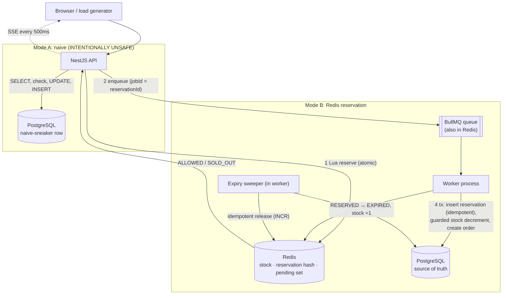
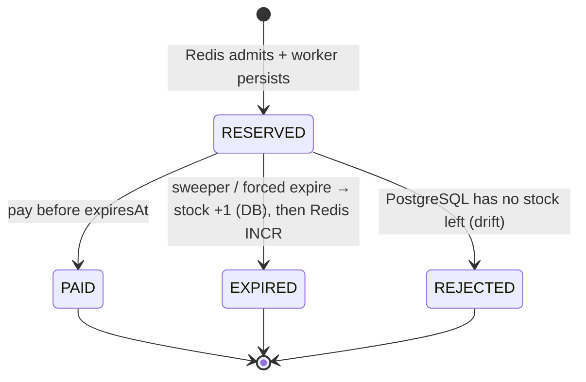

# ⚡ Flash Sale Lab: preventing oversell under extreme concurrency

An educational, runnable demo. 500 units go on sale at 12:00 and up to 2,000,000 people press **Buy**.
You watch a naive PostgreSQL checkout **oversell**, then watch a Redis-admission + queue + idempotent-worker design
**hold the line**, and then you **break that design on purpose** to see what Redis atomicity does *not* solve.

> This is a learning tool, not a production e-commerce system. Wherever it matters, the code and docs separate
> **"safe enough for this demo"** from **"what production needs"**.

## 🎬 Story mode (start here if you're not an engineer)

Open the dashboard. The default **🎬 Story mode** tab plays a *tiny, slowed-down, real* sale: **10 shoppers, 5 sneakers**.

- **Shop A: the naive shop.** Every cashier checks the shelf and sees "5 left", then pauses (stretched to 2.5 s so you can see it), then writes the order. Shoppers animate from the door to "checked the shelf" to "order written". The shelf count drops below zero, and the ending reads **"10 orders for 5 sneakers"**.
- **Shop B: the ticket-desk shop.** A ticket desk (Redis) hands out exactly 5 tickets, one at a time. Everyone else hears "sold out" instantly. Ticket holders wait in line (the queue) while **one** clerk (the worker) writes each order into the order book (PostgreSQL). The ending reads **"5 orders for 5 sneakers"**.

Every shopper action is recorded as a numbered **step**. Use **◀ Previous / Next ▶** (or the ← → keys), **⏮ / ⏭**, the scrubber, or **▶ Play / ⏸ Pause** to move through them. Set *Playback* to "Step by step" to advance only when you click. Each step has its own caption ("👩 Shopper 3 checks the shelf and sees 5 sneakers…"), highlights the shopper it's about, and shows the shelf and ticket counts as they were at that moment. A narration bar explains the overall phase in plain words, and "What do these pictures mean in tech terms?" maps each picture to its component. It isn't a canned animation: the backend really runs the naive and Redis code paths, just with pacing knobs turned up. An integration test checks that Shop A really oversells and Shop B really doesn't. The **🔬 Lab** tab is the full-scale technical dashboard described below.

## What this demo teaches

- Why `SELECT stock → check → UPDATE` oversells (check-then-act and lost update), and how to *see* the race window.
- Why a correct SQL version (conditional `UPDATE … WHERE stock > 0`) is safe but turns into a single-row bottleneck.
- Why Redis `DECR` is atomic, when you actually need **Lua**, and what the classic "DECR, INCR back if negative" answer leaves out.
- Why a **queue** sits between the spike and the database, and what at-least-once delivery means for you.
- Why reservations need a **TTL** and a **DB-driven** expiry (not Redis key expiry), and why expiry must be safe to run twice.
- Why **idempotency** (a reservation ID as the primary key, side effects inside the guard) is mandatory.
- Why **PostgreSQL stays the source of truth**, and how Redis and PostgreSQL **drift apart** (crash between writes, data loss, re-seeding), plus how reconciliation repairs it.

## Architecture



| Component | Role |
|---|---|
| **NestJS API** (`apps/api`, `main.ts`) | HTTP endpoints, SSE stream, load-test runner, serves the dashboard in Docker |
| **Worker** (`apps/api`, `worker.main.ts`) | Separate process: consumes the queue at a fixed concurrency and runs the expiry sweeper every second |
| **Redis** | Fast admission: stock counter, reservation hashes, pending set, per-user key; also hosts BullMQ, config, metrics, events |
| **PostgreSQL** (Prisma) | Durable record: `Product`, `Reservation`, `Order` with unique constraints |
| **Dashboard** (`apps/web`, Vite + React) | Live pipelines, invariants, failure lab, event stream |

Design spec: [`docs/superpowers/specs/2026-10-04-flash-sale-demo-design.md`](docs/superpowers/specs/2026-10-04-flash-sale-demo-design.md) ·
Plan: [`docs/superpowers/plans/2026-10-04-flash-sale-demo.md`](docs/superpowers/plans/2026-10-04-flash-sale-demo.md)

## Quick start

**Everything in Docker (one command):**

```bash
docker compose up --build
# open http://localhost:3000 and press "Reset demo"
```

**Local development** (hot reload; needs Node ≥ 22.12):

```bash
npm install
npm run infra        # docker compose up -d postgres redis
npm run dev          # applies migrations, then runs API :3000, worker, dashboard :5173
# open http://localhost:5173 and press "Reset demo"
```

> Run *either* the full Docker stack *or* `npm run dev`. Both use port 3000.
> To go from Docker to dev: `docker compose stop api worker`.

## Naive implementation

`POST /api/naive/buy` → [`apps/api/src/naive/naive.service.ts`](apps/api/src/naive/naive.service.ts). **Intentionally unsafe** in its default variant:

```
SELECT stock → if stock > 0 → (artificial delay) → UPDATE stock → INSERT order
```

Variants (dashboard "Mode A variant"):
- `check-then-act`: `stock = stock − 1`. Oversells, and the stock goes **negative**.
- `lost-update`: `stock = <value read> − 1`. Oversells **and hides it** (stock looks fine, orders > stock).
- `atomic`: `UPDATE … SET stock = stock − 1 WHERE stock > 0` in a transaction. **Correct**, but every buyer serializes on one row.

Tracked: requests, successes, sold-outs, errors, DB queries, the **race window** (requests between read and write, now and peak), oversold quantity, final DB stock, and latency.

## Redis implementation

`POST /api/flash-sale/buy` → [`reservation.service.ts`](apps/api/src/flash/reservation.service.ts) + [`redis-scripts.ts`](apps/api/src/flash/redis-scripts.ts):

1. **Atomic admission** (strategy `lua`, the default): one Lua script checks stock, enforces one reservation per user, `DECR`s, writes the reservation hash and adds it to a `pending` set. Strategy `decr` is the classic interview answer (`DECR`; if negative, `INCR` back).
2. **202 Reserved** right away (*"Reserved for 30 seconds. Complete payment before the reservation expires."*) or **409 Sold out**. No database access on this path.
3. **Enqueue** a BullMQ job whose `jobId` and payload carry the **reservationId**.
4. **Worker**: Lua `confirm` handshake → one PostgreSQL transaction: `INSERT reservation … ON CONFLICT DO NOTHING` (PK = reservationId) → only if inserted, `UPDATE product SET stock = stock − 1 WHERE stock > 0 AND saleId = <job's saleId>` (a **fencing token**: messages from an older sale are refused) → create order `PENDING_PAYMENT` → after the commit, remove it from the Redis `pending` set.

## How to run a flash-sale simulation

Dashboard → **🔬 Lab** tab → **Reset demo** (initial stock, default 500) → choose **Concurrent users** (100 / 500 / 1,000 / 10,000 or custom) and **in-flight connections** (default 100) → **Run naive test (A)** or **Run Redis test (B)**.

The API runs the load generator against itself. Browsers allow only about 6 connections per host, so the page can't generate this load directly. For bigger runs from a separate process:

```bash
npm run load:naive -- --users 2000 --reset
npm run load:redis -- --users 20000 --concurrency 200
```

## How to observe overselling

1. Reset with stock 500, keep "Mode A variant" = `check-then-act`, delay 20 ms.
2. Run naive with 1,000 users. Measured on a laptop: **551 orders for 500 units, stock −51**, with up to **85 requests inside the race window at once**.
3. Switch to `lost-update` and repeat: orders > 500, stock still ≥ 0. The *stock + orders = initial* invariant turns red.
4. Switch to `atomic`: exactly 500 orders. Compare its latency with Mode B.

## How Redis prevents reservation oversell

Redis executes commands one at a time, so `DECR` (or the whole Lua script) can't interleave with another buyer's. Measured: **10,000 requests → exactly 500 RESERVED, 9,500 SOLD_OUT**, p95 about 33 ms at 100 connections. Redis stock never went below 0 with Lua. With the `decr` strategy the counter visibly dips below 0 for a moment (the dashboard shows "lowest value DECR returned"), but admissions stay correct.

Redis only guarantees that **admissions** don't oversell. **Durable orders** are protected by PostgreSQL's guarded `UPDATE … WHERE stock > 0`. The *Redis data loss → re-seed from initial* experiment shows why that second guard is needed. → [docs/03](docs/03-redis-atomicity.md)

## Why the queue exists

The queue separates **arrival rate** (a spike of millions) from the **rate PostgreSQL can absorb** (steady, at most `workerConcurrency` transactions in parallel per worker, default 16). Only admitted requests (≤ stock) become messages. Pause or slow the worker in the Failure lab: buyers still get instant answers, and only persistence lags behind. BullMQ stands in for Kafka here; [docs/04](docs/04-queue.md) maps the concepts and explains what changes at scale.

## Reservation expiration



- The TTL is configurable (default **30 s** instead of 10 min).
- Expiry is **driven by PostgreSQL** (`status = 'RESERVED' AND expires_at < now()`). Redis key TTLs never return stock.
- Every transition is a **conditional update** (`WHERE status = 'RESERVED'`). Concurrent or duplicate expiry returns stock exactly once, and pay-vs-expire has exactly one winner (both are tested).
- Expiry is two steps (DB transaction, then the idempotent Redis release). `redisReleasedAt` lets the sweeper finish step 2 after a crash.

APIs: `POST /api/flash-sale/buy` · `GET /api/flash-sale/reservations/:id` (Redis vs DB view) · `POST …/:id/pay` · `POST …/:id/expire` · `POST …/:id/release` · `POST /api/flash-sale/expire-due` · `POST /api/flash-sale/pay-random`.

## Failure scenarios

All are buttons in the dashboard's **Failure lab**, and all are covered by integration tests (`apps/api/test/failures.int-spec.ts`, `worker-idempotency.int-spec.ts`, `lifecycle.int-spec.ts`).

| Experiment | What you'll see | What repairs it |
|---|---|---|
| Pause / slow worker | instant 202s, queue grows, PostgreSQL lags, pay → 409 NOT_PERSISTED | resume; the queue drains |
| Duplicate delivery | "duplicates ignored" rises, orders don't | idempotent transactional worker |
| …with idempotency **broken** | conservation invariant fails: stock vanishes | that's the bug; see docs/06 |
| API crash after Redis reservation (e.g. 20%) | measured: 116 leaked units; Redis says *sold out* while PostgreSQL has 116 left (**undersell**); orphan invariant red | **Reconcile** releases orphans (all 116) |
| Redis data loss, re-seed from initial | Redis re-admits sold units; worker REJECTS them; DB never negative | re-seed from DB; DB guard |
| Redis data loss, re-seed from DB | correct stock, but queued (unpersisted) buyers are lost | durable log / outbox in production |
| Expire / pay racing | exactly one wins | conditional updates |
| Worker confirmed a reservation, then its job died (e.g. DB down through all retries) | reservation stays `pending`; orphan invariant red | **Reconcile** re-publishes the message (idempotent worker) |
| Straggler message from before a reset / Redis data loss | `STALE_MESSAGE_DROPPED`; nothing written | **saleId fencing token**: the worker's guarded `UPDATE … WHERE saleId = ?` refuses old-sale messages |

Details: [docs/07-failure-modes.md](docs/07-failure-modes.md).

## Running tests

```bash
npm run infra              # tests need PostgreSQL + Redis (they use DB flashsale_test and Redis DB 1)
npm test                   # unit: state machine, stats, keys, config + the real Lua scripts against Redis
npm run test:integration   # Nest app + Redis + PostgreSQL: HTTP, worker, lifecycle, failures, invariants, naive oversell
npm run test:all
```

The **critical invariant test** (`apps/api/test/invariant.int-spec.ts`) runs 2,000 concurrent reservations on 500 units for both strategies. It asserts: allowed = 500 (≤ 500), Redis stock ≥ 0, and after the real BullMQ worker drains and some reservations are paid, PAID + RESERVED ≤ 500, conservation holds, one order per reservation, drift = 0. A second test fires 1,000 real HTTP requests at 100 units. The naive tests **pass when the bug happens**: they prove `check-then-act` and `lost-update` oversell.

## Running load tests

```bash
npm run reset -- --stock 500
npm run load:naive -- --users 2000                       # prints latency table + PostgreSQL stock/orders/oversold
npm run load:redis -- --users 10000 --concurrency 100    # prints outcomes + Redis/DB stock
```

Options: `--users`, `--concurrency`, `--url`, `--reset`, `--stock`, `--no-report`. Results also appear on the dashboard.
**macOS note:** the kernel caps the listen backlog at 128 (`kern.ipc.somaxconn`). Above roughly 128 simultaneous *new* connections, SYNs get dropped and retried after 1 s, which inflates p99 to about 2 s. That's a load-generator artifact, so the default is 100 connections.

## Project structure

```
apps/api/                 NestJS (one codebase, two processes)
  prisma/                 schema + migrations (Prisma 7, driver adapter pg)
  src/naive/              Mode A (intentionally unsafe variants)
  src/flash/              Mode B: redis-scripts (Lua), reservation, persistence (worker), lifecycle,
                          reconcile, worker.runner, reservation-state (state machine)
  src/admin/              state snapshot + invariants, SSE stream, simulations, reset & failure injection
  src/common/             env, keys, demo config, telemetry (events/metrics), Prisma, Redis, queue
  src/loadgen/            load generator + latency stats (shared by dashboard and CLI)
  scripts/                load.ts, reset.ts (CLI)
  test/                   integration tests
apps/web/                 Vite + React dashboard
packages/shared/          type-only API contracts shared by api and web
docs/                     01–09 teaching docs; superpowers/ spec, plan, setup notes
docker-compose.yml, Dockerfile, infra/postgres-init.sql
```

## Production limitations

This demo runs single-node Redis with the queue in the **same** Redis (losing Redis loses inventory *and* queue). The API → queue dual write is repaired by a reconciler instead of being prevented by an outbox. The per-user limit lives only in Redis. There's one hot stock key, a blind "overwrite stock" button, and no auth, payments, bot protection or waiting room. [docs/08-production-considerations.md](docs/08-production-considerations.md) lists what you'd do instead. To rehearse the interview answer, read [docs/09-interview-answer.md](docs/09-interview-answer.md).

### Tech notes

- **NestJS 11**, not 12: NestJS 12 is ESM-only, and Jest can't load ESM through `require` on Node < 24.9. NestJS 11 runs on Node 22 with standard Jest.
- **TypeScript 5.9**: ts-jest supports TS < 7.
- Workflow tooling: Superpowers plugin (project scope). See [docs/superpowers/SETUP.md](docs/superpowers/SETUP.md).

## Teaching docs

1. [The problem](docs/01-problem.md) · 2. [Naive solution](docs/02-naive-solution.md) · 3. [Redis atomicity](docs/03-redis-atomicity.md) · 4. [Queue](docs/04-queue.md) · 5. [Reservations](docs/05-reservations.md) · 6. [Idempotency](docs/06-idempotency.md) · 7. [Failure modes](docs/07-failure-modes.md) · 8. [Production considerations](docs/08-production-considerations.md) · 9. [Interview answer](docs/09-interview-answer.md)
