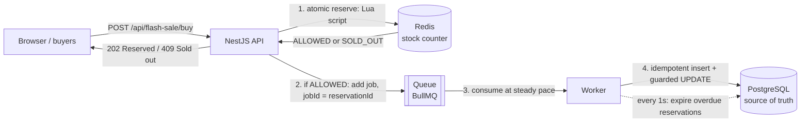

# 01 · The problem: 500 sneakers, 2,000,000 buyers

> Reading order: **01 problem** → [02 naive solution](02-naive-solution.md) → [03 Redis atomicity](03-redis-atomicity.md) → [04 queue](04-queue.md) → [05 reservations](05-reservations.md) → [06 idempotency](06-idempotency.md) → [07 failure modes](07-failure-modes.md) → [08 production](08-production-considerations.md) → [09 interview answer](09-interview-answer.md)

## The scenario

A shop announces a limited sneaker drop: **500 pairs, on sale at 12:00 PM sharp**. Thousands of people have the page open and press "Buy" the moment the clock flips. Bots press it hundreds of times a second. In the first few seconds the backend receives **up to 2,000,000 buy requests** for 500 units.

Two things must be true at the end:

1. **No overselling.** At most 500 people end up with an order. Never 501.
2. **The site stays up.** The 1,999,500 people who don't get a pair should get a fast "Sold out", not a spinning page or a 504 Gateway Timeout.

The first is a *correctness* requirement, the second is a *capacity* requirement. A lot of designs satisfy one and break the other.

## The naive flow

This is how almost everyone writes a checkout the first time:

```text
1. SELECT stock FROM product WHERE id = 'sneaker'     -- read
2. if stock > 0:                                       -- check
3.     UPDATE product SET stock = stock - 1 ...        -- act
4.     INSERT INTO "Order" ...                         -- record
```

Run one request at a time and it is perfect. Run thousands at once and it breaks, because steps 1 and 3 are **separate** operations with a gap between them.

### What "overselling" means

**Overselling** = confirming more orders than you have units. If 500 pairs exist and 636 people get an "Order created" response, 136 of them will later get an apology email and a refund. That costs money, trust, and in some jurisdictions it is a legal problem (you accepted a contract you cannot fulfil).

It happens because of a **race condition**: a bug where the result depends on the exact timing of concurrent operations. In the flow above, if 300 requests all run step 1 *before* any of them reaches step 3, all 300 read `stock = 1`, all 300 pass the check, and all 300 create an order. [02 · Naive solution](02-naive-solution.md) walks through this step by step.

## Why this is hard

It is tempting to think "just use a transaction" or "just add a lock". Those make it *correct* (see doc 02), but a flash sale also attacks your capacity from four directions at once:

| Pressure | What it means | Why it hurts |
|---|---|---|
| **Contention** | Many requests competing for the same resource at the same instant. | Correct solutions make them take turns. Taking turns is slow. |
| **One hot row** | Every buyer reads and writes the *same* row: `product.stock` for the sneaker. | You can't spread the load over many rows or many database servers. A database is great at many users touching many rows, and much weaker at many users touching one row. |
| **Connection pools** | An app talks to PostgreSQL over a limited number of open connections (a *pool*, typically 10 to 100 per app instance; this demo uses `DB_POOL_SIZE=20` per process). | 2,000,000 requests queue for ~20 connections. Each waiting request holds memory, a socket and a timer. Timeouts cascade. |
| **Latency** | Every database step is a network round-trip (typically 0.2 to 2 ms locally, more in the cloud), plus the time the row lock is held. | If one buyer holds the row for 2 ms, the row can serve at most ~500 buyers per second, no matter how big the server is. |

And the database is not only serving the sale: product pages, user logins and other people's orders use it too. If the sale saturates it, **the whole site goes down**.

The key observation: of 2,000,000 requests, **only 500 can possibly succeed**. That's 0.025%. The other 99.975% are doomed from the start, and a good design rejects them as cheaply as possible, *before* they reach the database.

## The target architecture



Read it left to right:

1. **Redis is the bouncer** ([doc 03](03-redis-atomicity.md)). Redis is an in-memory data store that runs each command one at a time, so "decrement the counter if it's above zero" can be done **atomically** (as one indivisible step that nothing can interrupt). It answers in well under a millisecond. 1,999,500 requests stop here with "Sold out" and never touch PostgreSQL.
2. **The queue is the waiting room** ([doc 04](04-queue.md)). The ≤ 500 admitted requests become messages. The API answers immediately (`202 Accepted`) without waiting for the database.
3. **The worker is the clerk.** It takes messages off the queue at a pace PostgreSQL can handle (16 at a time by default) and writes the reservation and order.
4. **PostgreSQL is the ledger.** It stays the **source of truth**: the one place whose answer wins when stores disagree. The worker *re-checks* stock there with a guarded update. Redis is a fast cache of the decision, and PostgreSQL is the record of it.
5. **Reservations expire** ([doc 05](05-reservations.md)). An admitted buyer gets a time-boxed hold ("Reserved for 30 seconds"), not a finished sale. If they don't pay in time, a sweeper gives the unit back.

The request path in code ([`apps/api/src/flash/reservation.service.ts`](../apps/api/src/flash/reservation.service.ts)) says it in one comment:

```ts
/**
 * Mode B request path. The ONLY thing that happens synchronously, while the user waits:
 *
 *   1. atomic admission in Redis (Lua script or DECR)
 *   2. publish a message to the queue (if admitted)
 *   3. answer immediately
 *
 * PostgreSQL is not touched here. That is the whole point: 2,000,000 requests become
 * at most `stock` queue messages, and the database only ever sees those.
 */
```

## Redis atomicity alone does not solve every distributed-systems problem

This is the most important caveat in the whole repository, and the reason the demo has a "Failure lab".

The common interview answer ("use Redis `DECR`, then push to Kafka") is right about the *happy path*. But the moment you have **two systems** (Redis and PostgreSQL, plus a queue), you get problems that no single atomic command can fix:

- **Dual writes.** The API writes to Redis, then to the queue. If it crashes between the two, Redis has given away a unit that no message will ever persist. That unit is *leaked*. ([07 · Failure modes](07-failure-modes.md))
- **Duplicate messages.** Queues deliver *at least once*: a message may arrive twice after a retry or a worker crash. Without care, one reservation becomes two orders. ([06 · Idempotency](06-idempotency.md))
- **Redis is not durable by default.** If Redis loses data, it may admit units PostgreSQL already sold. Only the database guard stops the oversell then. ([03](03-redis-atomicity.md#the-honest-limits-admission-is-not-a-durable-sale), [07](07-failure-modes.md))
- **Expiry needs two writes too**: give the unit back in PostgreSQL *and* in Redis. ([05](05-reservations.md))
- **Stale work.** A message admitted before a reset (or a Redis rebuild) can arrive after it and write into the *new* sale. A primary key can't spot it, because the new sale has never seen that id; it takes a **fencing token** that changes with every sale. ([07](07-failure-modes.md#10-stale-messages-after-a-reset-the-fencing-token))
- **Drift.** After any of the above, Redis's counter and PostgreSQL's stock disagree. Something has to detect and repair that (reconciliation). ([07](07-failure-modes.md))

Redis atomicity prevents oversell **of Redis admissions**. Preventing oversell of **durable orders** takes the database guard, idempotent workers, and reconciliation as well.

## What the demo lets you observe

The dashboard runs both designs side by side against the same initial stock:

- **Mode A (naive PostgreSQL):** `POST /api/naive/buy`. Three variants: two intentionally broken ones and one correct-but-slow one. You watch the order count pass the stock, live.
- **Mode B (Redis + queue + worker):** `POST /api/flash-sale/buy`. You watch admissions stop at exactly the stock, the queue fill and drain, and PostgreSQL catch up.
- **Invariants panels** turn red when a rule is broken. An **invariant** is a statement that must always be true, for example "orders ≤ initial stock" or "DB stock + RESERVED + PAID = initial".
- **Failure lab:** break things on purpose (pause the worker, duplicate messages, crash the API mid-request, wipe Redis) and watch which invariant breaks and what repairs it.

Real results from a MacBook (dev mode):

| Run | Result |
|---|---|
| Naive check-then-act, 2,000 requests, 500 stock, 500 in-flight connections, 20 ms delay | **636 orders**, stock **−136** (oversold by 136) |
| Same, via the dashboard: 1,000 requests, 100 connections | **551 orders**, stock −51; up to **85 requests** were inside the race window at once |
| In Docker: 2,000 requests, 100 connections | 548 orders, oversold by 48 |
| Redis mode (Lua), 10,000 requests, 100 connections | exactly **500 RESERVED, 9,500 SOLD_OUT**; p50 18.6 ms, p95 32.8 ms, p99 64.8 ms; Redis stock 0, then PostgreSQL stock 0 after the worker drained |

(p50/p95/p99 are **latency percentiles**: p95 = 32.8 ms means 95% of requests finished within 32.8 ms. The tail, p99, is what your unluckiest users feel.)

## Glossary

Terms used throughout the docs. Each doc re-explains them briefly on first use.

| Term | Plain meaning |
|---|---|
| **Race condition** | A bug where the outcome depends on the timing of concurrent operations. Works in testing, fails under load. |
| **Atomic** | Happens as one indivisible step: other operations see either "before" or "after", never a half-done state. |
| **Check-then-act** | Reading a value, deciding based on it, then writing. Unsafe under concurrency unless check and act are one atomic step. |
| **Lost update** | Two writers both read X, both write "X − 1"; one write silently overwrites the other. |
| **Transaction** | A group of database statements that commit together or not at all. |
| **Row lock** | PostgreSQL's way of making writers to the same row take turns. Held until the transaction ends. |
| **Isolation level** | How much concurrent transactions can see of each other (READ COMMITTED, REPEATABLE READ, SERIALIZABLE). Stronger = fewer anomalies, more retries. |
| **Hot row / hot key** | One row or key that a huge share of traffic hits. It can't be spread across machines. |
| **Connection pool** | A fixed set of open DB connections shared by requests. When all are busy, requests wait. |
| **Admission control** | Deciding cheaply, up front, who may proceed. Redis's job here. |
| **Source of truth** | The store whose data wins in a disagreement. Here: PostgreSQL. |
| **Lua script (Redis)** | A small program Redis runs atomically on the server, so several reads and writes form one step. |
| **Hash tag** | The `{...}` part of a Redis key. In Redis Cluster, keys with the same tag live on the same server. |
| **Queue / job / worker** | A queue stores messages (jobs). A worker process takes them off and does the slow work. |
| **At-least-once delivery** | The queue promises every message is processed, possibly more than once. |
| **Idempotent** | Doing it twice has the same effect as doing it once. |
| **Reservation** | A temporary hold on a unit, which becomes a sale if paid before it expires. |
| **TTL (time to live)** | How long something lasts before it expires: a reservation's 30 s, or a Redis key's auto-delete timer. |
| **Dual write** | Writing the same fact to two systems without a shared transaction. A crash in between leaves them inconsistent. |
| **Drift** | Two stores disagreeing about the same number, e.g. Redis stock vs. what PostgreSQL implies. |
| **Reconciliation** | A job that compares stores, finds drift, and repairs it. |
| **Invariant** | A rule that must always hold. The dashboard checks them live. |
| **Fencing token** | An id that changes with every new "generation" (here, every new sale). Work stamped with an old token is refused by the store it writes to. |

## Try it in the demo

1. Start everything (`docker compose up --build` and open http://localhost:3000, or `npm run infra && npm run dev` and open http://localhost:5173).
2. Start on the **🎬 Story mode** tab: press **Shop A** and then **Shop B** to watch 10 shoppers and 5 sneakers in slow motion, with plain-language narration. Then switch to the **🔬 Lab** tab for the full-scale version below.
3. Under **1 · Set up the sale**, enter 500 and press **↺ Reset demo**.
4. Under **2 · Send buyers**, pick **1,000** concurrent users, keep **In-flight connections** at 100, and press **▶ Run naive test (A)**. Watch the Mode A panel: "orders created" climbs past 500, and the invariant **Orders ≤ initial stock** turns red with "OVERSOLD by …".
5. Press **↺ Reset demo** again, then **▶ Run Redis test (B)**. "allowed (202)" stops at exactly 500, the rest are "sold out (409)". Watch the queue depth rise and fall as the worker writes to PostgreSQL, and all Mode B invariants stay green.
6. Skim the **Event stream** to see the individual events (`NAIVE_ORDER_CREATED`, `RESERVATION_ALLOWED`, `ORDER_CREATED`, …).

Then read [02 · The naive solution](02-naive-solution.md) to see exactly why step 3 oversold.
