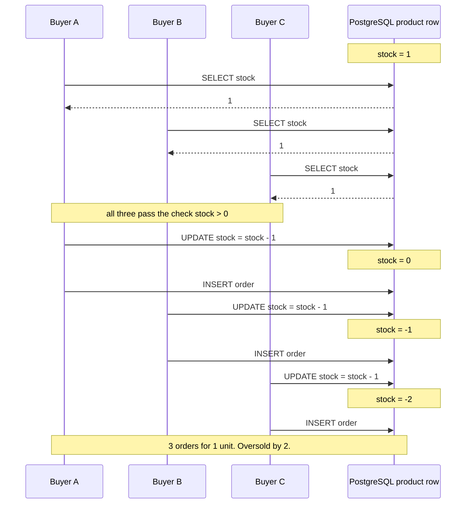
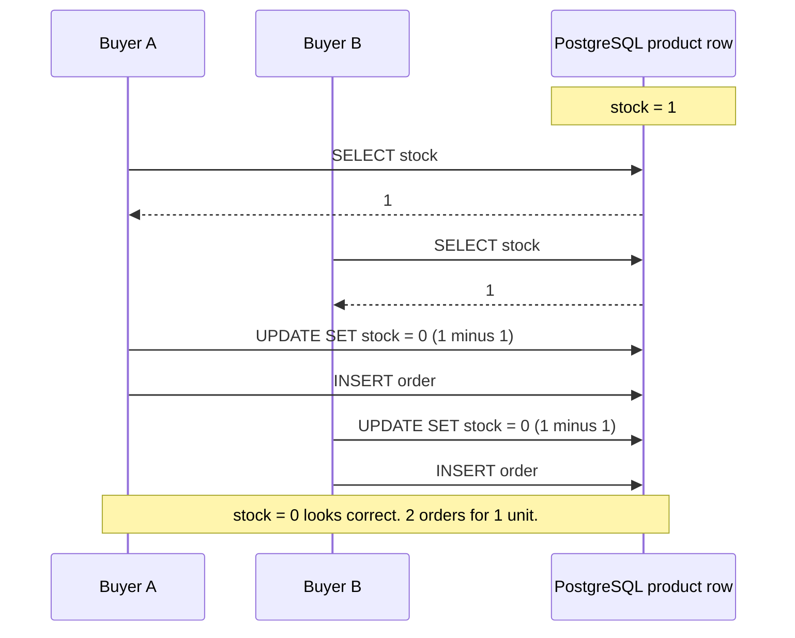

# 02 · The naive solution (Mode A) and why it oversells

Mode A puts the whole checkout in PostgreSQL. It has three variants, selected by the **Mode A variant** dropdown (the `naiveVariant` knob):

| Variant | What step 4 does | Outcome under load |
|---|---|---|
| `check-then-act` (default) | `stock = stock - 1` | **Oversells**, and the stock goes negative. Visible. |
| `lost-update` | `stock = <value I read> - 1` | **Oversells**, but the stock looks fine. Hidden. |
| `atomic` | one conditional `UPDATE ... WHERE stock > 0` | Correct. Shows what correctness costs. |

All code below is from [`apps/api/src/naive/naive.service.ts`](../apps/api/src/naive/naive.service.ts). The first two variants are **intentionally unsafe**. Never copy them.

## The unsafe code

```ts
private async buyUnsafe(userId: string, variant: 'check-then-act' | 'lost-update', delayMs: number) {
  const product = await this.prisma.product.findUniqueOrThrow({ where: { id: PRODUCT } }); // 1. SELECT
  if (product.stock <= 0) {
    return { status: 'SOLD_OUT', ... };                                                      // 2. check
  }
  ...
    if (delayMs > 0) await sleep(delayMs); // 3. the window between check and act

    await this.prisma.product.update({
      where: { id: PRODUCT },
      data: variant === 'check-then-act' ? { stock: { decrement: 1 } } : { stock: product.stock - 1 }, // 4. UPDATE
    });
    const order = await this.prisma.order.create({ data: { productId: PRODUCT, userId, source: 'NAIVE', status: 'PAID' } }); // 5. INSERT
```

(Abridged: the real function also records telemetry and the race-window gauge.)

Notice there is **no transaction** and **no lock**. Each `await` is a separate round-trip to PostgreSQL. Between the `SELECT` and the `UPDATE`, the Node.js event loop happily runs other requests, and PostgreSQL happily serves other connections.

## How check-then-act oversells

A **race condition** is a bug whose outcome depends on timing. Here's the race with one unit left and three buyers:



Each individual statement is fine. The bug is the **gap**: the decision ("there is stock") is based on a reading that is already stale by the time we act on it. This pattern is called **check-then-act** (or TOCTOU, time-of-check to time-of-use).

Because `stock = stock - 1` is evaluated by PostgreSQL against the *current* value, no decrement is lost. So with check-then-act:

- `stock` goes **negative**: −136 in our 2,000-request run.
- `stock + orders = initial` still holds: 636 + (−136) = 500. The books balance, they're just below zero.

The negative stock is a loud alarm. That's the "good" kind of oversell.

## The lost-update variant: the oversell you can't see

Now change step 4 to "set the stock to what I read, minus one": `stock: product.stock - 1`. This is what you get when code loads an object, changes a field in memory, and saves the object back (a common ORM pattern).



B's write overwrites A's. A's decrement is **lost**, hence the name **lost update**. The result:

- `stock` looks perfectly healthy (≥ 0, often exactly 0 at the end).
- There are more orders than units.
- The invariant `stock + orders = initial` **breaks**: 0 + 2 ≠ 1.

This is worse than the negative stock. A monitoring alert on `stock < 0` never fires. You only find out when the warehouse can't ship. The integration test spells it out ([`apps/api/test/naive.int-spec.ts`](../apps/api/test/naive.int-spec.ts)):

```ts
expect(n).toBeGreaterThan(STOCK);
expect(stock).toBeGreaterThanOrEqual(0); // looks healthy...
expect(stock + n).not.toBe(STOCK);       // ...but the books don't balance
```

That's why the dashboard shows **three** invariants for Mode A, not one: `Orders ≤ initial stock`, `DB stock ≥ 0`, and `stock + orders = initial stock`. Each variant breaks a different subset, and the conservation check (the third one) catches the lost update that the stock check misses.

## The artificial delay knob

The **Artificial DB delay** slider (0–100 ms, default 20, the `naiveDelayMs` knob) inserts a `sleep` between the check and the act. It simulates everything that happens between those two steps in real code: a price calculation, a call to a fraud service, a slow network, GC pauses.

It does **not** create the bug. It only widens the window so the bug is easy to see on a laptop. Set it to **0 ms** and the race still exists, just narrower:

- `SELECT` and `UPDATE` are still two separate round-trips, each taking a fraction of a millisecond plus queueing time for a pool connection.
- With 100 in-flight requests and a pool of 20 connections, many requests sit between "got my SELECT answer" and "got a connection for my UPDATE".
- At 2,000,000 requests in a few seconds, even a microsecond-wide window is hit thousands of times.

The **"in the race window now / peak"** stat counts how many requests are currently between their SELECT and their UPDATE. In a 1,000-request dashboard run we saw a peak of **85 requests** in the window at once. Each of those had already passed the check.

> **Rule:** if your correctness depends on the window being small, you don't have correctness. You have luck.

## Correct PostgreSQL approaches

There are three standard ways to make this correct inside the database. All of them work. None of them scales to a flash sale.

Some definitions first:

- A **transaction** groups statements so they commit or roll back together.
- A **row lock** is held by a transaction that updates (or `SELECT ... FOR UPDATE`s) a row. Any other transaction that wants to write that row **waits** until the first commits or rolls back.
- The **isolation level** decides what a transaction sees of concurrent ones. PostgreSQL's default is **READ COMMITTED**: each statement sees data committed before it started.

### 1. Conditional atomic UPDATE (the demo's `atomic` variant)

Merge check and act into one statement, and let the database tell you whether it worked:

```ts
// apps/api/src/naive/naive.service.ts, buyAtomic()
const result = await this.prisma.$transaction(async (tx) => {
  const updated = await tx.product.updateMany({ where: { id: PRODUCT, stock: { gt: 0 } }, data: { stock: { decrement: 1 } } });
  if (updated.count === 0) return null;   // sold out
  return tx.order.create({ data: { productId: PRODUCT, userId, source: 'NAIVE', status: 'PAID' } });
});
```

In SQL: `UPDATE product SET stock = stock - 1 WHERE id = $1 AND stock > 0`, then check the affected row count. Why it's safe: PostgreSQL locks the row for the UPDATE. If another transaction already holds the lock, this one waits. When the lock is released, PostgreSQL **re-reads the newest version of the row and re-evaluates `stock > 0`** before applying the update. So the 501st buyer finds `stock = 0`, matches zero rows, and gets "sold out". The test proves it: 300 concurrent buyers, 50 units → exactly 50 orders, stock 0.

"Did my update change exactly one row?" is a pattern you'll see again: the worker uses it in [04](04-queue.md) and the reservation lifecycle uses it in [05](05-reservations.md).

### 2. `SELECT ... FOR UPDATE` (pessimistic locking)

Keep the read-check-write shape, but lock the row at read time:

```sql
BEGIN;
SELECT stock FROM product WHERE id = $1 FOR UPDATE;  -- take the row lock now
-- if stock <= 0: ROLLBACK, sold out
UPDATE product SET stock = stock - 1 WHERE id = $1;
INSERT INTO "Order" ...;
COMMIT;                                              -- lock released here
```

Everyone else's `SELECT ... FOR UPDATE` blocks until this transaction commits. Correct, but the lock is now held across **several round-trips** and any application logic in between, which is even longer than option 1. (The demo doesn't ship this variant; option 1 shows the same behaviour with a shorter lock.)

### 3. SERIALIZABLE isolation + retry

Run the original read-check-write in a `SERIALIZABLE` transaction. PostgreSQL detects that two concurrent transactions read the same stock and both wrote it, and aborts one with a **serialization failure** (SQLSTATE `40001`). Your code must catch that and **retry** the whole transaction. (Even `REPEATABLE READ` would abort the lost-update variant with "could not serialize access due to concurrent update".)

Correct, but under heavy contention most transactions abort and retry, so you do more work for the same result.

### Correct is not the same as scalable

All three approaches make buyers **take turns on one row**. That's the definition of a hot row.

- **Throughput is capped by lock hold time.** If each transaction holds the row lock for ~2 ms (UPDATE, INSERT, COMMIT round-trips), the row can admit at most ~500 buyers per second. Buying a bigger database does not help: it's one row on one machine.
- **Every request still costs a connection and a round-trip**, including the 1,999,500 that will be told "sold out". With a pool of 20 connections per process, 2,000,000 requests form a queue in your app servers, and the timeouts start.
- **The database is shared.** While it's busy serializing sneaker buyers, product pages and logins slow down too.

Compare latency yourself: run the same load with `check-then-act` and then with `atomic`. The atomic variant never oversells, but you'll typically see higher latency percentiles, because requests now wait for the row lock instead of racing past each other.

The fix isn't a cleverer SQL statement. It's to **stop sending doomed requests to the database at all**. That's what Redis does in [03 · Redis atomicity](03-redis-atomicity.md).

## Try it in the demo

1. **Reset demo** with 500 units. Mode A variant **check-then-act**, delay **20 ms**, **1,000** users, **100** in-flight connections. Press **▶ Run naive test (A)**. Expect ~550 orders, DB stock around −50, and the invariants `Orders ≤ initial stock` and `DB stock ≥ 0` red while `stock + orders = initial stock` stays green. Watch "in the race window now / peak".
2. **Reset**, switch the variant to **lost-update**, run again. Now `DB stock ≥ 0` is green but `Orders ≤ initial stock` and `stock + orders = initial stock` are red: the detail line says "lost updates are hiding the oversell".
3. **Reset**, set the delay slider to **0 ms**, back to check-then-act, and run with **10,000** users. The oversell is smaller but usually still there.
4. **Reset**, switch to **atomic**, run again. Exactly 500 orders, stock 0, all green. Compare the latency panel with step 1.
5. From the CLI, for a bigger push: `npm run load:naive -- --users 2000` (add `--concurrency 500 --reset --stock 500` to reproduce the 636-orders run).
6. The proof as a test: `npm run test:integration` runs [`naive.int-spec.ts`](../apps/api/test/naive.int-spec.ts). Its first two tests **pass when the bug happens**.
