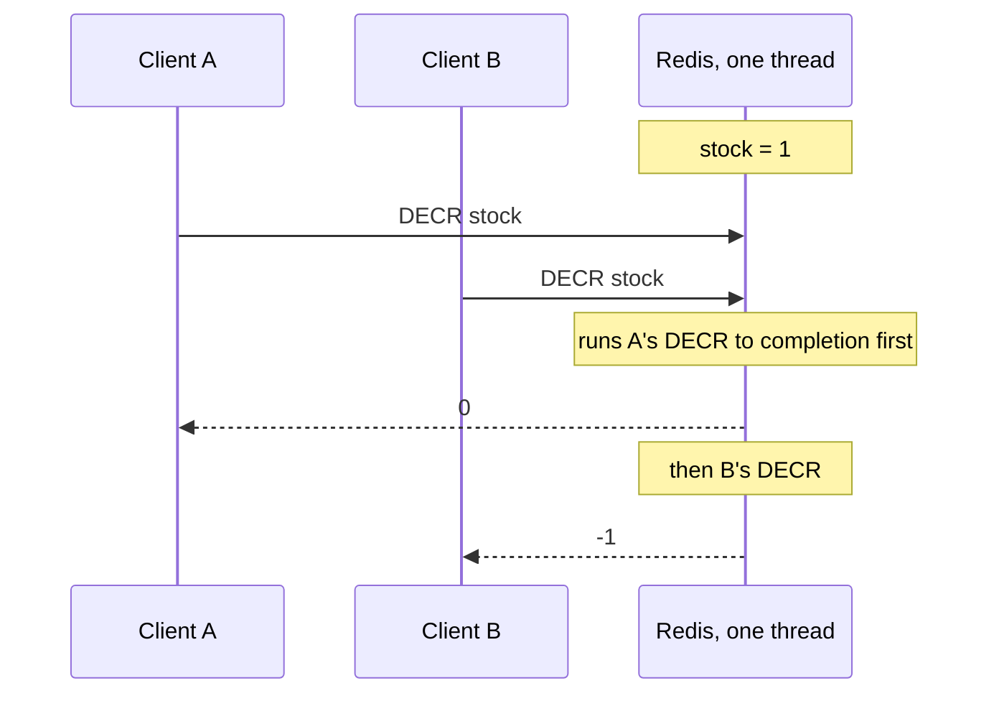

# 03 · Redis atomicity: the bouncer at the door

[Doc 02](02-naive-solution.md) ended with: correct SQL serializes every buyer on one hot row, and every doomed request still costs a DB connection. This doc covers the layer that turns 2,000,000 requests into ≤ 500 *before* the database sees any of them.

## What Redis is, and why it's fast

**Redis** is an in-memory data store. You send it commands over TCP (`GET key`, `SET key value`, `DECR key`, `HSET hash field value`, …) and it answers, usually in well under a millisecond. It's fast because:

- **Everything lives in RAM.** No disk read on the request path. (Persistence to disk happens in the background, see [the limits](#the-honest-limits-admission-is-not-a-durable-sale).)
- **Commands are tiny.** `DECR` on a counter is a few hundred CPU instructions.
- **No locks, no transactions to coordinate**, because of the next point.

A single Redis core handles on the order of **100,000+ simple operations per second**. That's the ceiling for one key on one server. More on that in [08 · Production](08-production-considerations.md).

## Single-threaded execution: why `DECR` is atomic

Redis executes commands **one at a time, on one thread**. (Since Redis 6, optional I/O threads read and write sockets in parallel, but the commands themselves still run one after another on the main thread.)

So `DECR stock` (read the number, subtract 1, write it back, return the new value) happens as **one indivisible step**. **Atomic** means exactly that: no other client's command can run in the middle of it. Two clients can never both read "1" and both write "0". Compare the naive SQL flow, where read and write were separate requests with a gap between them.



A got `0` (≥ 0, so A got the last unit). B got `-1`, which means "there was nothing left".

## The interview strategy: `DECR`, then `INCR` if negative

The classic answer, shipped as the `decr` strategy ([`apps/api/src/flash/redis-scripts.ts`](../apps/api/src/flash/redis-scripts.ts)):

```ts
async reserveWithDecr(i: ReserveInput) {
  const stockKey = keys.stock(i.productId);
  const observed = await this.r.decr(stockKey);
  if (observed < 0) {
    await this.r.incr(stockKey);      // put it back: we overshot
    return { result: 'SOLD_OUT', remaining: 0, observed, compensated: true };
  }
  await this.r.multi()
    .hset(keys.reservation(i.productId, i.reservationId), { status: 'RESERVED', ... })
    .zadd(keys.pending(i.productId), i.nowMs, i.reservationId)
    .exec();
  return { result: 'ALLOWED', ... };
}
```

**It is correct for the counter.** Each `DECR` is atomic, so exactly `stock` callers ever see a value ≥ 0. The integration test runs 2,000 concurrent attempts on 500 units with this strategy and gets exactly 500 admissions. But it has caveats you can observe:

1. **Transient negatives.** Between a losing `DECR` and its compensating `INCR`, the counter is negative. Anyone reading it then (a dashboard, a "units left" banner, another service) sees −37. The script test asserts this: the lowest value `DECR` returned is `< 0`, even though the counter settles at 0. The dashboard shows it as "lowest value DECR returned".
2. **Two writes per sold-out request.** The 1,999,500 losers each do `DECR` *and* `INCR`. At flash-sale scale that doubles the load on the hottest key, exactly when you can least afford it. The dashboard counts these as "DECR went negative → INCR back".
3. **`DECR` on a missing key creates it at −1.** If the stock key was never seeded (or Redis lost it), `DECR` silently treats it as 0 and returns −1. You get "sold out" for a sale that never started, and after the compensating `INCR` the key now exists at 0: a stock value nobody ever seeded, which hides the real problem.
4. **No atomic per-user limit.** "One pair per customer" needs "check the user hasn't reserved *and* decrement". Two separate commands means two requests from the same user can both pass the check.
5. **The reservation record is a separate step.** The `HSET` + `ZADD` happen *after* the `DECR`, in a second round-trip. If the process dies in between, the counter is decremented and there is **no trace** of who holds the unit. Nobody can find or release it.

## Choosing the right tool: single command, MULTI/EXEC, WATCH, or Lua

| Tool | What it gives you | When to use it |
|---|---|---|
| **One command** (`DECR`, `INCR`, `SET NX`, `HINCRBY`) | Atomic read-modify-write of **one key** | Whenever a single command expresses the whole decision. Cheapest option. |
| **`MULTI` / `EXEC`** | A batch of commands run back-to-back, nothing interleaved | Several writes that must happen together, where **no write depends on what an earlier command returned**. You can't say "if the GET returned > 0, then DECR" inside MULTI: the commands are queued before any of them runs. The `decr` strategy uses MULTI for its `HSET` + `ZADD`. |
| **`WATCH` + `MULTI`** | Optimistic locking: read keys, then `EXEC` fails if any watched key changed meanwhile, and you retry | Conditional logic under **low** contention. On a hot key in a flash sale almost every `EXEC` fails and retries, so it degrades into a retry storm. |
| **Lua script** (`EVAL` / `EVALSHA`) | Arbitrary logic (reads, `if`s, writes to several keys) run as **one atomic step** on the server | The decision depends on a read **and** must update several keys together. That's our case. |

A sequence of commands sent from Node is **not** atomic: other clients' commands can run between them. A Lua script is: Redis runs it start to finish without running anything else.

## The reserve script, line by line

The default `lua` strategy. Keys and arguments are passed in, never built inside the script:

```lua
-- KEYS: 1 stock, 2 reservation hash, 3 user key, 4 pending zset, 5 sale id
-- ARGV: 1 reservationId, 2 userId, 3 nowMs, 4 expiresAtMs
local stock = redis.call('GET', KEYS[1])
if not stock then
  return {'NOT_INITIALIZED', -1, '', ''}
end
stock = tonumber(stock)
local existing = redis.call('GET', KEYS[3])
if existing then
  return {'ALREADY_RESERVED', stock, '', existing}
end
if stock <= 0 then
  return {'SOLD_OUT', stock, '', ''}
end
local sale = redis.call('GET', KEYS[5]) or ''
local remaining = redis.call('DECR', KEYS[1])
redis.call('HSET', KEYS[2], 'status', 'RESERVED', 'userId', ARGV[2], 'createdAt', ARGV[3], 'expiresAt', ARGV[4], 'confirmed', '0', 'saleId', sale)
redis.call('SET', KEYS[3], ARGV[1])
redis.call('ZADD', KEYS[4], ARGV[3], ARGV[1])
return {'ALLOWED', remaining, sale, ''}
```

Every branch returns the same four slots: `{result, remaining, saleId, existingReservationId}`.

1. **`GET` the stock.** If the key doesn't exist, refuse with `NOT_INITIALIZED` instead of letting `DECR` invent a −1 (caveat 3 fixed). The API turns this into `503`.
2. **Per-user check.** If `flash:{flash-sneaker}:user:<userId>` exists, this user already holds a reservation: `ALREADY_RESERVED` (`409`). Caveat 4 fixed, because the check and the decrement are in the same atomic step. The script also returns the reservation id stored in that key, and the API puts it in the `409` body. Why: if the client's first response was lost (timeout, dropped connection) and it retries, it still learns which reservation it holds and can pay for it, instead of being stuck with "you already have one" and no id ([06](06-idempotency.md)).
3. **Sold out?** `stock <= 0` → `SOLD_OUT` (`409`), **without writing anything**. One read, zero writes for the 99.975% (caveats 1 and 2 fixed). The counter never goes below 0.
4. **Read the sale id** (`flash:{flash-sneaker}:sale`). It identifies the current sale and changes on every reset; the worker uses it as a **fencing token** so a message from an older sale can't write into the new one ([07](07-failure-modes.md#10-stale-messages-after-a-reset-the-fencing-token)).
5. **`DECR`.** Safe now: we're inside the script, nobody can have changed the stock since line 1.
6. **`HSET` the reservation hash** with status, user, timestamps, `confirmed=0` (the worker flips it to 1 later, see [07](07-failure-modes.md)) and the `saleId`.
7. **`SET` the user key** to this reservation id, enforcing one reservation per user.
8. **`ZADD` to the `pending` sorted set**, scored by creation time. This means "admitted by Redis, not yet persisted in PostgreSQL". If the API dies before publishing the message, the reservation is still **findable** here, and the reconciler can release it (caveat 5 fixed).
9. Return `ALLOWED`, the remaining stock and the sale id (the API copies it into the queue message).

ioredis's `defineCommand` loads the script once and then calls it by its SHA1 hash (`EVALSHA`), so each request sends a short hash rather than the script text.

The script tests ([`redis-scripts.spec.ts`](../apps/api/src/flash/redis-scripts.spec.ts)) run against a **real** Redis, because a mock would test the mock and not the Lua. One fires 1,000 parallel reserves at 100 units: exactly 100 `ALLOWED`, 900 `SOLD_OUT`, and the minimum `remaining` ever returned is ≥ 0.

### The cost of Lua

While a script runs, Redis serves **nobody else**. That's what makes it atomic, and it's also the danger: a slow script stalls every client. After `busy-reply-threshold` (5 s by default) Redis starts answering other clients with `BUSY` errors. So scripts must stay **tiny and bounded**: no loops over big collections, no `KEYS *`. Ours do a handful of O(1) operations plus one O(log N) `ZADD`.

**Redis Functions** (Redis 7+, `FUNCTION LOAD` / `FCALL`) are the modern successor to `EVAL`: named libraries stored by the server and replicated with the data, so you don't depend on every client re-sending scripts after a restart. Same atomicity, same "keep it small" rule. The demo uses `EVALSHA` because it is simpler to read and widely known.

## Redis Cluster hash tags: why the keys look like `flash:{flash-sneaker}:stock`

**Redis Cluster** splits data across several servers by hashing each key into one of 16,384 **slots**. A multi-key script must only touch keys in the **same slot**, otherwise Redis refuses it with a `CROSSSLOT` error. (A script runs on one server, and it can't atomically touch data on another.)

A **hash tag** is the part of a key inside `{...}`: if present, Cluster hashes only that part. So every key containing `{flash-sneaker}` lands on the same slot, and the reserve script may touch all five. From [`apps/api/src/common/keys.ts`](../apps/api/src/common/keys.ts):

```ts
// The `{productId}` braces are a Redis Cluster *hash tag*: Cluster hashes only the
// part inside {...}, so all keys of one product land on the same slot. Multi-key Lua
// scripts require that. On a single Redis node the braces are just characters.
stock: (productId: string) => `flash:{${productId}}:stock`,
```

The flip side: all traffic for one product hits **one shard**. Adding servers doesn't make a single hot product faster. Production answers (stock buckets, a local sold-out flag) are in [08](08-production-considerations.md).

## The Redis keys

| Key | Type | Value | TTL | Lifecycle |
|---|---|---|---|---|
| `flash:{flash-sneaker}:stock` | string int | units Redis will still admit | none | seeded on reset, `DECR` on reserve, `INCR` on release |
| `flash:{flash-sneaker}:res:<rid>` | hash | status, userId, createdAt, expiresAt, confirmed, saleId | none while RESERVED; 1 h after a terminal state | created by reserve; `confirmed=1` by the worker; status → EXPIRED / PAID / ORPHAN_RELEASED / REJECTED |
| `flash:{flash-sneaker}:user:<uid>` | string | rid | none | set on reserve (per-user limit, Lua strategy only); deleted when the reservation is released |
| `flash:{flash-sneaker}:pending` | sorted set | rid → createdAt ms | none | added on reserve; removed only **after** the worker's PostgreSQL commit, when the worker rejects the message, or on orphan release / expiry. "Admitted but not yet persisted" |
| `flash:{flash-sneaker}:sale` | string | current sale id (fencing token) | none | new random id on reset and on simulated Redis data loss; mirrors `Product.saleId` in PostgreSQL |
| `flash:config` | hash | demo knobs | none | dashboard writes, API and worker read |
| `flash:metrics`, `naive:metrics` | hash | counters | none | `HINCRBY`; observability only, not truth |
| `flash:{events}:list` / `flash:{events}:seq` | list / int | last 200 JSON events | none | one Lua script does `INCR` seq + `LPUSH` + `LTRIM`; the shared `{events}` hash tag keeps both keys in one Cluster slot |
| `sim:last:<mode>`, `sim:current` | string JSON | load-run results / progress | none | written by the load runner |
| `bull:reservations:*` | BullMQ | queue internals | n/a | managed by BullMQ ([04](04-queue.md)) |

Note the TTL column. The only TTL is a 1-hour **garbage-collection** timer on finished reservation hashes. No TTL drives business logic. Why that matters is in [05](05-reservations.md).

## The honest limits: admission is not a durable sale

An `ALLOWED` from the script (and the `202` the API sends for it) means "Redis decided you may proceed". It does **not** mean the sale is recorded anywhere durable.

- **Persistence is asynchronous.** **RDB** snapshots write the dataset to disk every few minutes, so a crash loses everything since the last snapshot. **AOF** (append-only file) logs every write; with `appendfsync everysec` (what `docker-compose.yml` uses here) it flushes to disk once per second, so a crash can lose about the last second of acknowledged writes. `appendfsync always` is safer and much slower.
- **Replication is asynchronous.** The primary acknowledges a write before replicas have it. If the primary dies and a replica is promoted, writes the client already saw succeed can be **gone**. (`WAIT` reduces this window but does not make Redis a strongly consistent store.)
- **So Redis can "forget" admissions.** If it comes back with an older stock value (or is re-seeded from the initial stock), it re-admits units PostgreSQL already sold. Only the worker's guarded `UPDATE ... WHERE stock > 0` in PostgreSQL stops a real oversell; those buyers get `REJECTED` after being told "reserved". The Failure lab reproduces this ([07](07-failure-modes.md)).

Redis is the **cache of the decision**. PostgreSQL is the **record of the decision**.

## Watching it with redis-cli

```bash
docker compose exec redis redis-cli
```

```text
> GET "flash:{flash-sneaker}:stock"
"500"
```

Buy one unit from the **Try it yourself** panel (user `alice`), copy the reservation id, then:

```text
> GET "flash:{flash-sneaker}:stock"
"499"
> GET "flash:{flash-sneaker}:user:alice"
"3f1c…"                                  # the reservation id
> HGETALL "flash:{flash-sneaker}:res:3f1c…"
 1) "status"     2) "RESERVED"
 3) "userId"     4) "alice"
 5) "createdAt"  6) "1791115200123"
 7) "expiresAt"  8) "1791115230123"
 9) "confirmed" 10) "1"                  # the worker already picked it up
11) "saleId"    12) "9b2e…"              # the sale this reservation belongs to
> ZCARD "flash:{flash-sneaker}:pending"
(integer) 0                              # persisted in PostgreSQL, so no longer pending
> TTL "flash:{flash-sneaker}:res:3f1c…"
(integer) -1                             # no TTL while RESERVED
```

Press **⏸ Pause worker** first and buy as a different user: `confirmed` stays `"0"` and `ZCARD` on `pending` is 1. After the reservation expires or is paid, `TTL` on the hash shows ~3600 (garbage collection only). Watch everything live with `MONITOR` (never in production: it slows Redis down).

## Try it in the demo

1. **Reset demo** with 500 units, Mode B reserve strategy **Lua: check-and-reserve (never negative)**, **10,000** users, **100** connections, **▶ Run Redis test (B)**. Exactly 500 "allowed (202)" and 9,500 "sold out (409)"; `Redis stock ≥ 0` reads "never observed below 0". Check the latency panel (we measured p50 18.6 ms, p95 32.8 ms, p99 64.8 ms: mostly HTTP, Node and the queue publish, not Redis).
2. **Reset**, switch the strategy to **DECR, INCR back if negative (interview answer)**, run again. Still exactly 500 allowed, but "lowest value DECR returned" is negative and "DECR went negative → INCR back" counts ~9,500 compensations.
3. In **Try it yourself**, press **🛒 Buy** twice with the same user. With Lua the second answer is `409 ALREADY_RESERVED`, and its `reservationId` is the one from the first buy; with DECR both succeed.
4. CLI: `npm run load:redis -- --users 10000`. If you raise `--concurrency` to 500 on macOS, p99 may jump to ~2 s. That is the macOS TCP listen backlog (`kern.ipc.somaxconn` = 128) dropping connection attempts that the client retries after 1 s, a load-generator artefact rather than Redis. It's why the default is 100 connections.
5. Tests: `npm test` runs the Lua script tests against real Redis (start it with `npm run infra`); `npm run test:integration` includes the 2,000-on-500 invariant test for both strategies.
