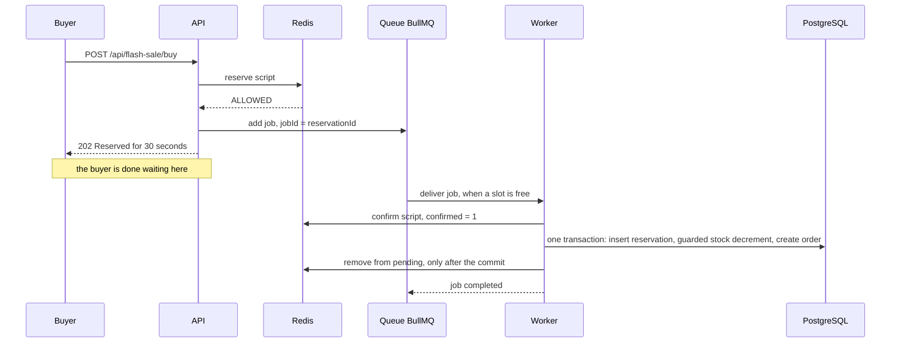

# 04 · The queue: absorbing the burst

Redis ([doc 03](03-redis-atomicity.md)) has decided *who* may buy. Someone still has to write those ≤ 500 reservations and orders into PostgreSQL. This doc covers why that happens through a queue, how BullMQ works, how it maps to Kafka, and what a queue does **not** solve.

## Why a queue at all?

Two rates are involved:

- **Arrival rate:** how fast requests come in. In a flash sale: spiky, up to 2,000,000 in a few seconds.
- **Absorption rate:** how fast the database can safely write. Steady, a few thousand transactions per second at best, and it has other work to do.

A **queue** sits between them. Producers (the API) put **messages** in at whatever rate they arrive, and consumers (the **worker**) take them out at the rate they can handle. The queue *decouples* the two rates. The spike becomes a backlog, and the backlog drains at a controlled pace.

Three properties make this work in our design:

1. **Only admitted requests are enqueued.** Redis already turned away everyone who can't buy, so the queue receives **at most `stock` messages** (500), not 2,000,000. The queue is small, and the DB load is bounded by the stock, not by the traffic.
2. **The API answers in milliseconds.** It doesn't wait for PostgreSQL. It returns **`202 Accepted`**, the HTTP status for "your request was accepted; processing continues asynchronously".
3. **The worker's concurrency is fixed.** The worker processes 16 jobs at a time by default (the `workerConcurrency` demo knob, applied live; story mode drops it to 1 so you can watch a single clerk), whatever the spike looks like. PostgreSQL sees at most 16 concurrent writers from it.



## BullMQ basics

**BullMQ** is a Node.js job queue that stores everything **in Redis** (keys starting with `bull:reservations:`). Its vocabulary:

- **Job:** one message: a name, a JSON payload (`data`), an id, and options. Ours is `ReservationJob`:

  ```ts
  // apps/api/src/common/queue.service.ts
  export interface ReservationJob {
    reservationId: string;
    productId: string;
    userId: string;
    createdAtMs: number;
    expiresAtMs: number;
    /** Fencing token: the sale this reservation was admitted under (see Product.saleId). */
    saleId: string;
  }
  ```

  `saleId` is there so the worker can recognise a message from an *older* sale (one that was in flight when the demo was reset) and drop it instead of writing it into the new sale. See [07](07-failure-modes.md#10-stale-messages-after-a-reset-the-fencing-token).

- **Queue:** a named list of jobs (`reservations`). The API holds a `Queue` object and calls `add()`.
- **Worker:** a process that pulls jobs and runs a handler. Ours runs `PersistenceService.persist(job.data)` in a separate process (`worker.main.ts`), so slowing or pausing it never slows the API.
- **`jobId`:** we set it to the **reservation id**. BullMQ ignores an `add()` whose id it still holds. This gives *some* producer-side dedupe.
- **`attempts` / `backoff`:** if the handler throws (say PostgreSQL is briefly unreachable), BullMQ tries up to 8 times with exponential backoff: 0.5 s, 1 s, 2 s, … 64 s, about 2 minutes in total. Why so long: with a short budget (the first version had 5 attempts over ~3 s), a PostgreSQL restart of a few seconds would turn every in-flight buyer's job into a permanently failed one. If a job still fails for good, the reconciler re-publishes it ([07](07-failure-modes.md)).
- **`removeOnComplete` / `removeOnFail`:** finished jobs are kept for a while for inspection, then deleted.
- **Pause:** `queue.pause()` stops all workers from taking new jobs (jobs already running finish). New jobs pile up in "waiting".
- **Stalled jobs:** a worker holds a lock on each job it's processing and keeps renewing it. If the worker dies, the lock expires, and BullMQ hands the job to another worker. The job runs **again**.

The configuration, from [`apps/api/src/common/queue.service.ts`](../apps/api/src/common/queue.service.ts):

```ts
readonly queue = new Queue<ReservationJob>(env.queueName, {
  connection: this.connection,
  defaultJobOptions: {
    // ~8 attempts over ~2 minutes (0.5s, 1s, 2s, ... 64s) so a short PostgreSQL outage doesn't
    // turn into permanently failed jobs. If a job still fails for good, the reconciler re-drives it.
    attempts: 8,
    backoff: { type: 'exponential', delay: 500 },
    // Keep finished jobs around for a while so you can inspect them, but not forever.
    removeOnComplete: { age: 3600, count: 5000 },
    removeOnFail: { age: 24 * 3600, count: 5000 },
  },
});

/**
 * jobId = reservationId gives us *some* producer-side dedupe: BullMQ ignores an add with an id
 * it still remembers. Once the job is removed, the same id can be added again, so the worker
 * must be idempotent anyway.
 */
add(job: ReservationJob, jobId = job.reservationId) {
  return this.queue.add(PERSIST_JOB, job, { jobId });
}
```

## Why BullMQ and not Kafka (for this demo)

The interview answer usually says "publish to Kafka". The demo uses BullMQ because:

- **No extra infrastructure.** It runs on the Redis we already have. Kafka needs a broker (and, depending on the version, a KRaft controller), topics and partitions.
- **It shows what we need to show:** job ids, retries, pause/resume, counts, and redelivery, all visible on the dashboard.
- **The lessons transfer unchanged.** At-least-once delivery, idempotent consumers and the dual-write problem apply to both.

### BullMQ ↔ Kafka concept map

| BullMQ | Kafka | Notes |
|---|---|---|
| Job | Record (message) | Kafka records have a key, a value and headers; the key decides the partition. |
| Queue | Topic | A Kafka topic is split into **partitions**; a BullMQ queue is one logical list. |
| Worker concurrency (16) | Partitions × consumer-group members | In Kafka, each partition is read by at most one member of a **consumer group**. Parallelism is capped by the partition count. In BullMQ you just raise `concurrency` or start more workers. |
| `jobId` dedupe | Idempotent producer | **Only partially comparable.** Kafka's idempotent producer stops duplicates caused by *that producer's own retries* (per partition, using sequence numbers). It does not dedupe by your business key. BullMQ's `jobId` dedupes by *your* id, but only while the job is still stored. Neither makes the consumer safe from duplicates. |
| `removeOnComplete` (1 h / 5,000 jobs) | Log retention (by time or size) | BullMQ deletes a job once processed and aged out. Kafka keeps records for the retention period whether or not anyone read them. |
| No ordering promise with concurrency > 1 | Ordering **per partition** only | Records with the same key go to the same partition and are read in order. There is no global order across partitions. |
| Replay: not really (re-add the job) | Replay: reset the consumer group's offset | Kafka consumers track an **offset** (position in the log). Rewinding it re-reads history. That's why Kafka is used for event sourcing and rebuilding state. |
| Waiting count | **Consumer lag** | Lag = how far the consumer's offset is behind the newest record. The single most important queue metric. |

## What changes at real scale

With Kafka (or another durable log) in production:

- **The queue is a durable, replicated log.** A record acknowledged with `acks=all` is on several brokers' disks. A broker crash doesn't lose it.
- **Partitions are the unit of parallelism.** Choose the key with care: keying by `productId` keeps one product's events in order but puts a hot product on one partition. Keying by `reservationId` spreads load but drops cross-reservation ordering (which we don't need: every reservation is independent).
- **Consumer lag is your health signal.** Alert when lag grows: it means buyers are waiting longer for their reservation to be persisted.
- **"Exactly-once" has fine print.** Kafka's exactly-once semantics (transactions + `read_committed`) cover *read from Kafka → process → write to Kafka*. The moment your consumer writes to **PostgreSQL**, you are back to at-least-once, and the consumer must be idempotent. There is no free lunch.

## The big caveat: BullMQ lives in the same Redis as the inventory

The comment in `queue.service.ts` says it plainly:

```ts
// BullMQ is a queue *stored in Redis*. Conceptually it plays the role Kafka plays in the
// interview answer: it absorbs the burst so the worker can write to PostgreSQL at its own pace.
// Big difference: it lives in the same Redis as the stock counter, so losing Redis loses both.
```

If Redis loses its data, you lose the stock counter, the reservation hashes, the pending set **and every queued-but-unprocessed message**, all at once. Buyers who were told "Reserved" have no message that will ever persist their reservation. A separate durable log (Kafka, or Redis Streams on a separately persisted Redis), or a transactional outbox in PostgreSQL, would not share that fate. The Failure lab's **Redis data loss** buttons show the consequences ([07](07-failure-modes.md)).

## Delivery is at-least-once

Every practical queue delivers each message **at least once**, which means **sometimes more than once**:

- The worker commits to PostgreSQL, then crashes before telling BullMQ the job is done. The job stalls and is re-run.
- A handler throws after a partial side effect, and `attempts: 8` retries it.
- A producer retries an `add()` after a timeout, without knowing the first one succeeded.

"Exactly once" isn't something the queue can promise end to end. What you *can* build is **exactly-once effect**: the worker is **idempotent** (processing a message twice has the same effect as once). Here, the reservation id is the PostgreSQL primary key, so a second insert does nothing, and stock and order changes only happen if the insert did. Details and the deliberately broken variant: [06 · Idempotency](06-idempotency.md).

## The dual-write problem: "Redis reserved" and "message published"

Look again at the API path. It writes to **two places** with no transaction spanning both:

1. Redis: reserve script → unit taken.
2. Queue: `add()` → message exists.

If the process crashes (or the `add()` fails) **between** 1 and 2, Redis has handed out a unit that no message will ever persist and no sweeper will ever expire (the sweeper only knows rows in PostgreSQL). The unit is **leaked**. This is the classic **dual-write problem**.

The demo's mitigations: the Lua script records the reservation in the `pending` set *atomically with the decrement*, the worker *confirms* it (sets `confirmed=1`) and removes it from `pending` only **after** its PostgreSQL commit, and a **reconciler** looks at reservations that stayed pending too long with no queue job: it releases the unit if the worker never confirmed it, or re-publishes the message if it did. With BullMQ in the same Redis there's a neat production fix: append the message *inside* the reserve script (for example `XADD` to a Redis Stream), so reservation and message are one atomic step. The general fix is a **transactional outbox**. All of this is in [07 · Failure modes](07-failure-modes.md).

## What the buyer sees

Admitted buyers get `202` and a hold, not a finished purchase:

```json
{
  "status": "RESERVED",
  "reservationId": "3f1c…",
  "expiresAt": 1791115230123,
  "message": "Reserved for 30 seconds. Complete payment before the reservation expires."
}
```

Because persistence is asynchronous, there's a short moment when the reservation exists in Redis but not yet in PostgreSQL. If the buyer pays in that moment, `POST /api/flash-sale/reservations/:id/pay` answers **`409 NOT_PERSISTED`**: "Reservation accepted but not yet written to PostgreSQL by the worker. Retry in a moment." A real frontend would poll `GET /api/flash-sale/reservations/:id` until `persisted: true`, or retry the payment with backoff.

One more consequence: the 30-second clock starts **at admission** (`expiresAtMs` is computed in the API). Time spent waiting in the queue eats into the buyer's payment window. If the worker is paused for longer than the TTL, the reservation is persisted already overdue and the sweeper expires it on its next run ([05](05-reservations.md)). That's why queue lag matters for UX, not only for ops.

## Try it in the demo

1. **Reset demo** (500), then in the Failure lab press **⏸ Pause worker**. Run **▶ Run Redis test (B)** with 1,000 users. Admissions still stop at 500 and the API stays fast, but the queue depth sits at 500 "waiting" and PostgreSQL has no reservations. That's the decoupling.
2. In **Try it yourself**, press **🛒 Buy** (new user) while still paused, then **💳 Pay**. You get `409 NOT_PERSISTED`. Press **🔍 Inspect**: the Redis hash exists, the PostgreSQL row doesn't.
3. Press **▶ Resume worker** and watch the queue drain and the DB stock fall to 0. Try **Slow worker** (e.g. 200 ms per job) to watch the drain in slow motion.
4. Tick **API publishes every message twice** and run again: the counter "duplicates ignored" rises, and all invariants stay green (more in [06](06-idempotency.md)).
5. Look at the queue in Redis: `docker compose exec redis redis-cli` then `KEYS "bull:reservations:*"` (fine on a demo, never on a big production Redis) and `HGETALL "bull:reservations:<reservationId>"` to see a stored job.
