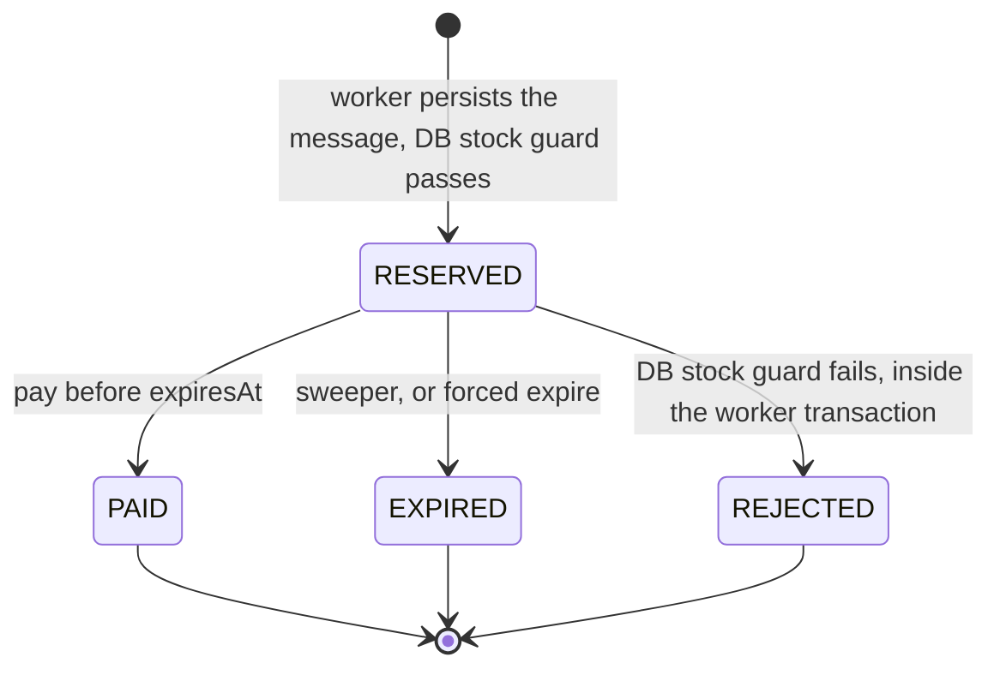
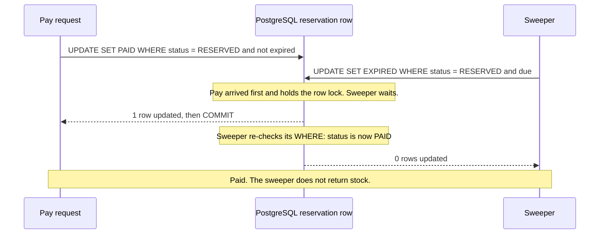

# 05 · Reservations: holds that expire safely

An admitted buyer doesn't get a finished sale. They get a **reservation**: a time-boxed hold on one unit. If they pay before it expires, it becomes a sale. If not, the unit goes back on sale. This doc covers the lifecycle, why expiry is driven by PostgreSQL and not by Redis TTLs, and how every transition stays safe when things run twice or race.

## Why reservations at all?

Payment is slow and can fail (3-D Secure, declined cards, people who walk away). If admission meant "sold", every abandoned checkout would be a lost unit. If we waited for payment before admitting, we'd be back to holding a lock during a slow external call. A reservation splits the two: **admission is fast and final for 30 seconds; the sale is final when paid.**

The hold length is the `reservationTtlSec` knob: **30 seconds** in the demo, so you can watch expiry happen; something like **10 minutes** in a real shop. (**TTL**, *time to live*, just means "how long until it expires".)

## The state machine

The PostgreSQL `Reservation.status` column ([`schema.prisma`](../apps/api/prisma/schema.prisma)) has four states:



- **RESERVED**: holding a unit. Counted in `stock + RESERVED + PAID = initial`. Has an order in `PENDING_PAYMENT`.
- **PAID**: final. The unit is sold. Order `PAID`.
- **EXPIRED**: final. The unit went back to stock (PostgreSQL first, then Redis). Order `CANCELLED`.
- **REJECTED**: final. Redis admitted it, but PostgreSQL had no stock (drift, e.g. after Redis data loss), or the reconciler had already released it. No order, no stock change. (The worker inserts RESERVED and flips it to REJECTED in the same transaction, so nobody else ever sees the RESERVED step.) After the commit the worker also marks the Redis hash `REJECTED`, removes it from `pending` and deletes the user's key so they can try again. It does **not** `INCR` the Redis stock: PostgreSQL never had that unit, so handing it back would only make the drift worse.

There's a fifth status that only exists in **Redis**: **ORPHAN_RELEASED**. The reconciler sets it on a reservation Redis admitted but that never reached the queue, so it never got a PostgreSQL row ([07](07-failure-modes.md)). A Redis `REJECTED` can also exist with **no** PostgreSQL row: when the worker drops a message from an older sale (the `saleId` fencing token, [07](07-failure-modes.md#10-stale-messages-after-a-reset-the-fencing-token)), its transaction is rolled back entirely. The Redis hash status mirrors the others: `RESERVED` → `PAID` / `EXPIRED` / `REJECTED` / `ORPHAN_RELEASED`.

The allowed moves are written down in [`reservation-state.ts`](../apps/api/src/flash/reservation-state.ts):

```ts
export const TRANSITIONS: Record<ReservationStatus, ReservationStatus[]> = {
  RESERVED: ['PAID', 'EXPIRED', 'REJECTED'],
  PAID: [],
  EXPIRED: [],
  REJECTED: [],
};
```

But the services **don't** enforce this table by reading the status first. That would be check-then-act all over again ([02](02-naive-solution.md)). They put the "from" state into the `UPDATE`'s `WHERE` clause and let the database enforce it. The table is used to *explain* refusals.

### The order lifecycle

Each persisted reservation has exactly one order (`Order.reservationId` is `UNIQUE`):

| Order status | When |
|---|---|
| `PENDING_PAYMENT` | Created by the worker together with the RESERVED reservation |
| `PAID` | Set in the same transaction as the reservation's RESERVED → PAID |
| `CANCELLED` | Set in the same transaction as RESERVED → EXPIRED |

(Mode A's naive orders are created directly as `PAID`, with no reservation.)

## Why we don't let Redis TTLs return the stock

The obvious idea: put `EXPIRE 30` on the Redis reservation and let Redis delete it when time's up. That doesn't work, for several reasons:

1. **Key expiry is silent.** When Redis deletes an expired key, it does exactly that. Nothing `INCR`s the stock counter. The unit is simply gone.
2. **Keyspace notifications are fire-and-forget.** Redis can publish an "expired" event (`notify-keyspace-events Ex`), but it's plain pub/sub: if your listener is disconnected or restarting at that instant, the event is lost forever. Nothing retries it.
3. **They fire late.** Redis deletes expired keys lazily (when someone touches the key) or in a background sampling cycle. The event fires on actual deletion, which can be noticeably after the TTL.
4. **PostgreSQL would never know.** The source of truth would still say RESERVED, the order would sit in PENDING_PAYMENT forever, and `Product.stock` would never get the unit back.
5. **In Redis Cluster**, each node only emits events for its own keys, so the listener must subscribe to every node.

The rule this demo follows, also written in [`redis-scripts.ts`](../apps/api/src/flash/redis-scripts.ts):

> **TTLs are for garbage collection, never for business logic.**

The only Redis TTL in the reservation flow is the 1-hour cleanup timer set on a hash *after* it reached a final state, so you can still inspect it for a while.

## DB-driven expiry: the sweeper

Expiry is driven by PostgreSQL. The worker process runs a **sweeper** every second (`SWEEP_INTERVAL_MS=1000`) that asks the database which reservations are overdue (`status = 'RESERVED' AND expiresAt <= now`; the `(status, expiresAt)` index makes this cheap) and expires each one ([`lifecycle.service.ts`](../apps/api/src/flash/lifecycle.service.ts)):

```ts
async sweep(batch = 500) {
  const due = await this.prisma.reservation.findMany({
    where: { status: 'RESERVED', expiresAt: { lte: new Date() } },
    select: { id: true },
    take: batch,
  });
  const results = await mapLimit(due, 10, (r) => this.expire(r.id));
  // Retry the Redis half for rows whose earlier attempt died between the two steps.
  const unreleased = await this.prisma.reservation.findMany({
    where: { status: 'EXPIRED', redisReleasedAt: null },
    ...
  });
  ...
}
```

Note that the `findMany` is just a *candidate list*. Reading it doesn't decide anything. The decision happens in the conditional update below, so it doesn't matter if the list is stale, or if two sweepers (two worker processes) read the same list.

## Conditional transitions: "did my update change exactly one row?"

Step 1 of expiry, in one transaction:

```ts
async expireInDbOnly(reservationId: string, opts: { force?: boolean } = {}): Promise<boolean> {
  const now = new Date();
  return this.prisma.$transaction(async (tx) => {
    const updated = await tx.reservation.updateMany({
      where: { id: reservationId, status: 'RESERVED', ...(opts.force ? {} : { expiresAt: { lte: now } }) },
      data: { status: 'EXPIRED', expiredAt: now },
    });
    if (updated.count === 0) return false;           // someone else got here first, or it's not due
    const row = await tx.reservation.findUniqueOrThrow({ where: { id: reservationId } });
    await tx.product.update({ where: { id: row.productId }, data: { stock: { increment: 1 } } });
    await tx.order.updateMany({ where: { reservationId }, data: { status: 'CANCELLED' } });
    return true;
  });
}
```

In SQL terms: `UPDATE "Reservation" SET status = 'EXPIRED' WHERE id = $1 AND status = 'RESERVED' AND "expiresAt" <= now()`, then look at the row count.

Why this is safe when eight sweepers run it at once:

- The first `UPDATE` takes the **row lock** on that reservation. The others wait.
- When the first commits, PostgreSQL re-checks the waiting updates' `WHERE` against the new row version (under the default READ COMMITTED isolation). `status = 'RESERVED'` is now false, so they update **0 rows**.
- Only the caller that changed exactly one row goes on to give the stock back. Everyone else returns `false` and does nothing.

So the unit is returned **exactly once**, without any read-then-write. The integration test fires 8 concurrent forced expiries at one reservation: exactly one reports `expired: true`, and PostgreSQL and Redis stock each go up by exactly 1. This is the same pattern as the `atomic` naive variant and the worker's guarded decrement. It is also what makes the sweeper **idempotent**: running it twice changes nothing the second time.

## Pay vs. expire: exactly one wins

Payment uses the same pattern, with the deadline in the `WHERE` clause:

```ts
const updated = await tx.reservation.updateMany({
  where: { id: reservationId, status: 'RESERVED', expiresAt: { gt: now } },
  data: { status: 'PAID', paidAt: now },
});
if (updated.count === 0) return false;
await tx.order.update({ where: { reservationId }, data: { status: 'PAID' } });
```

If the buyer clicks Pay at the very moment the sweeper expires the reservation:



Swap the arrival order and the expiry wins, so payment gets 0 rows and answers `409 EXPIRED`. Either way **exactly one** succeeds. The integration test runs this race 15 times and checks every time that exactly one of them won and that `stock + RESERVED + PAID = initial` still holds.

Pay also refuses a reservation whose `expiresAt` has passed even if the sweeper hasn't run yet (`expiresAt > now` in the `WHERE`). The deadline is the deadline, not "whenever the sweeper gets round to it".

When payment is refused, a follow-up read explains why, with these HTTP codes:

- No PostgreSQL row yet, so the answer depends on the Redis hash: status `RESERVED` → `409 NOT_PERSISTED` (the worker hasn't written it yet, so retry; see [04](04-queue.md)); any other Redis status, e.g. `ORPHAN_RELEASED` or `REJECTED` → `409 INVALID_STATE` (it will never be persisted, retrying won't help); no hash at all → `404 NOT_FOUND`.
- A PostgreSQL row exists: `409 ALREADY_PAID`, `409 EXPIRED`, or `409 INVALID_STATE` (e.g. REJECTED).

After a successful payment the API also marks the Redis hash `PAID`. That step is **best-effort**: PostgreSQL has already committed the payment, which is what counts, so a Redis error there is swallowed instead of turning a completed purchase into a `500`. The Redis hash is only a mirror for inspection.

## Two-step expiry and `redisReleasedAt`

Expiry has to give the unit back in **two** systems: PostgreSQL (`Product.stock + 1`) and Redis (the stock counter). They can't share a transaction, so this is another **dual write**. The order matters:

1. **PostgreSQL first** (`expireInDbOnly` above): status → EXPIRED, stock + 1, order → CANCELLED. This is the source of truth, so it decides.
2. **Redis second** (`releaseToRedis`): run the `release` Lua script, then record that it happened by setting `redisReleasedAt`.

```lua
-- RELEASE_LUA. KEYS: 1 stock, 2 reservation hash, 3 user key, 4 pending zset
local status = redis.call('HGET', KEYS[2], 'status')
if not status then return 'MISSING' end
if status ~= 'RESERVED' then return 'NOT_RESERVED:' .. status end
redis.call('HSET', KEYS[2], 'status', ARGV[2])     -- flip out of RESERVED...
redis.call('INCR', KEYS[1])                         -- ...and give the unit back, atomically
if redis.call('GET', KEYS[3]) == ARGV[1] then redis.call('DEL', KEYS[3]) end
redis.call('ZREM', KEYS[4], ARGV[1])
redis.call('EXPIRE', KEYS[2], ARGV[3])              -- garbage collection only
return 'RELEASED'
```

The script is idempotent on its own: it only `INCR`s if the hash is still `RESERVED`, and flips the status in the same atomic step. Five concurrent calls give one `RELEASED` and four `NOT_RESERVED:EXPIRED`. The user key is only deleted if it still points at *this* reservation, so a user who has since reserved again keeps their new hold.

**What if the process crashes between step 1 and step 2?** PostgreSQL says EXPIRED with the stock returned, but Redis is still one unit short. That's why the schema has:

```prisma
/// Expiry is a two-step dual write (DB first, then Redis INCR).
/// NULL on an EXPIRED row means "Redis has not been given the unit back yet" -> sweeper retries.
redisReleasedAt DateTime?
```

Every sweep also picks up `status = 'EXPIRED' AND redisReleasedAt IS NULL` rows and re-runs step 2. Because the Lua script is idempotent, re-running it after a *successful* release that crashed before setting the column is harmless. The integration test does exactly this: run only the DB half, check that Redis is still 1 unit short, sweep, and see Redis repaired.

Why PostgreSQL first? If Redis went first and the DB step then failed, Redis would re-admit a unit that PostgreSQL still counts as reserved, and a new buyer could be admitted for stock that doesn't exist yet. DB-first means the worst case is Redis being temporarily **too low** (a unit briefly unsellable), never too high.

## One reservation per user

With the Lua strategy, the reserve script refuses a user who already has a `flash:{flash-sneaker}:user:<userId>` key (`409 ALREADY_RESERVED`). The key is:

- **set** atomically with the reservation;
- **deleted** when the reservation is released (expiry or orphan release) or rejected by the worker, so the user may try again;
- **kept** after payment: one unit per user for the whole sale.

Limits, honestly: the rule lives **only in Redis**. The `decr` strategy has no per-user limit at all, and a Redis data loss forgets who held what. Production would add a database guard, for example a partial unique index such as `UNIQUE (productId, userId) WHERE status IN ('RESERVED','PAID')` (Prisma can't express that without raw SQL, which is why the demo skips it), plus identity and bot checks, because one person with 1,000 accounts defeats any per-user rule.

## The waitlist: where a returned unit goes

When a reservation expires (or the reconciler frees a leaked unit), the unit is free again. Who gets it?

- **Naive answer:** put it back in the stock. Then whoever happens to retry fastest grabs it, often a bot hammering "Buy", not the person who was told "sold out" first.
- **What the demo does:** sold-out shoppers can join a **waitlist**, a Redis sorted set ordered by join time (`flash:{flash-sneaker}:waitlist`). The release scripts (`RELEASE_LUA` and `RELEASE_ORPHAN_LUA` in `apps/api/src/flash/redis-scripts.ts`) end with a shared `giveBack` step:

```lua
local popped = redis.call('ZPOPMIN', waitKey)        -- first in line
-- (skip anyone who meanwhile got a unit another way)
redis.call('HSET', newResKey, 'status', 'RESERVED', 'userId', nextUser, ... 'via', 'waitlist')
redis.call('SET', nextUserKey, newRid)                -- one-per-user rule still holds
redis.call('ZADD', pendingKey, nowMs, newRid)         -- "admitted but not yet persisted"
-- only if nobody is waiting:
redis.call('INCR', stockKey)
```

The important property is **atomicity**. If we first INCR'd the stock and *then* tried to hand the unit to the waitlist, a random buyer could take it in between. Inside one script there is no "in between".

After the script, `WaitlistService.afterRelease` (`apps/api/src/flash/waitlist.service.ts`) publishes the new reservation's queue message, so it is persisted like any other, and writes a **notice** for the shopper. That's the demo's stand-in for a push notification: `GET /api/flash-sale/waitlist/:userId` answers `WAITING` (with your place in line), `OFFERED` (with the reservation and its deadline), `PAID` or `OFFER_ENDED`.

What happens when things go wrong:
- **The held shopper doesn't pay:** the hold expires like any reservation, and the release hands it to the *next* person in line.
- **The process dies after the hand-off but before publishing:** the held reservation is in `pending` with no queue job, which is exactly an orphan. The reconciler releases it, and the release hands it to the next person in line. Nothing is lost. The integration test `test/waitlist.int-spec.ts` covers this.
- **Joining is only allowed when it makes sense:** the join script refuses while stock is still available ("just buy") or while you already hold a reservation. Joining twice keeps your original place, and a successful normal buy removes you from the list.

**Demo vs production:** in production you'd add real notifications (push, email, SMS), a limit on waitlist size, an expiry for stale waitlist entries, and probably a shorter pay window for offers. The waitlist also lives in Redis, so a Redis data loss loses it (see [failure modes](07-failure-modes.md)).

## The API

All under `/api/flash-sale` ([`flash.controller.ts`](../apps/api/src/flash/flash.controller.ts)):

| Method & path | What it does | Responses |
|---|---|---|
| `POST /waitlist` `{userId}` | join the waitlist (only when sold out) | `WAITING` + position, `STOCK_AVAILABLE`, `ALREADY_RESERVED` |
| `GET /waitlist/:userId` | the "notification" | `WAITING`, `OFFERED` (+ reservationId, expiresAt), `PAID`, `OFFER_ENDED`, `NONE` |
| `POST /buy` `{userId}` | Redis reserve + enqueue | `202 RESERVED`, `409 SOLD_OUT`, `409 ALREADY_RESERVED` (body includes the `reservationId` you already hold), `503 NOT_INITIALIZED`, `500 SIMULATED_CRASH` |
| `GET /reservations/:id` | Both views side by side: the Redis hash and the PostgreSQL row + order (`persisted: true/false`) | `200`, `404` |
| `GET /reservations?limit=20` | Most recent reservations from PostgreSQL | `200` |
| `POST /reservations/:id/pay` | Conditional RESERVED → PAID, order → PAID, then mark the Redis hash PAID (best-effort) | `200 PAID`, `404`, `409 NOT_PERSISTED / EXPIRED / ALREADY_PAID / INVALID_STATE` |
| `POST /reservations/:id/expire` | **Forced** expiry (ignores `expiresAt`, demo only), both steps | `200 {expired, reason?, redis?}` |
| `POST /reservations/:id/release` | Re-run only the Redis half of expiry (idempotent) | `200 {outcome}` |
| `POST /expire-due` | Run one sweep now | `200 {expired, released}` |
| `POST /pay-random` `{percent}` | Pay a random share of active reservations (demo helper) | `200 {attempted, paid}` |

## Try it in the demo

1. **Reset demo**, set **Reservation TTL** to 30. In **Try it yourself**, press **🛒 Buy**, then **🔍 Inspect**: the Redis hash and the PostgreSQL row both say RESERVED, and the order is PENDING_PAYMENT.
2. Press **💳 Pay** before the countdown ends. Inspect again: PAID in both, order PAID. Press **Pay** again: `409 ALREADY_PAID`.
3. Buy as another user and **don't** pay. Within about a second of the countdown ending, the event stream shows `RESERVATION_EXPIRED` then `STOCK_RELEASED`, and both the DB stock and Redis stock go back up by one. Inspect: EXPIRED, order CANCELLED. Pay now: `409 EXPIRED`.
4. Buy again and press **⏱ Expire now** to force it. Press it again: nothing happens the second time ("already EXPIRED").
5. Run a Redis test (B) with a large TTL (e.g. 300), then **💳 Pay 50% of active**, then set the TTL low or wait, and press **⏱ Run expiry sweep now**. Check that `DB stock + RESERVED + PAID = initial` and `Redis agrees with PostgreSQL (drift = 0)` stay green.
6. Inspect a finished reservation in Redis: `docker compose exec redis redis-cli` then `HGETALL "flash:{flash-sneaker}:res:<id>"` and `TTL "flash:{flash-sneaker}:res:<id>"` (≈ 3600: garbage collection only).
7. Tests: `npm run test:integration` runs [`lifecycle.int-spec.ts`](../apps/api/test/lifecycle.int-spec.ts): concurrent expiry returns the unit once, a crash between the two expiry steps is repaired by the next sweep, and pay racing expire has exactly one winner.
