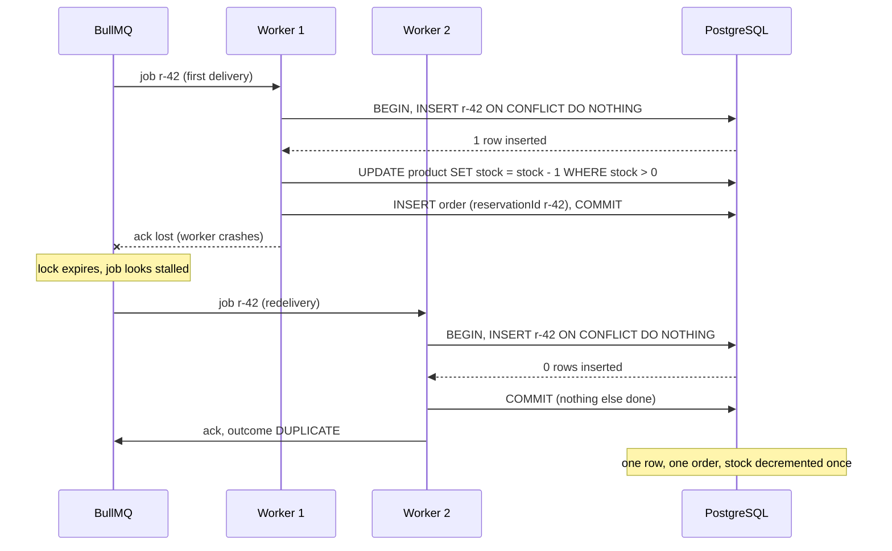

# 06 · Idempotency: surviving the duplicates that retries create

Previous: [Reservations with TTL](05-reservations.md) · Next: [Failure modes](07-failure-modes.md)

[Redis atomicity](03-redis-atomicity.md) stops *admission* from overselling, and the [queue](04-queue.md) protects PostgreSQL from the spike. Neither stops the same piece of work from running **twice**. This chapter explains why that happens all the time, and how the demo makes running twice harmless.

## 1. What "idempotent" means

An operation is **idempotent** if doing it twice has the same effect as doing it once.

- Pressing a lift's call button: the first press calls the lift, and the next ten presses change nothing. Idempotent.
- `SET stock = 10`: idempotent. Run it five times and stock is still 10.
- `stock = stock - 1`: **not** idempotent. Each run removes another unit.
- `INSERT INTO reservation (id, ...) VALUES ('r-42', ...) ON CONFLICT DO NOTHING`: idempotent. The second run finds `r-42` already there and does nothing.

Notice the word **effect**. An idempotent operation may *answer* differently the second time (the demo's second "Pay" says `ALREADY_PAID` instead of `PAID`). What must not change is the state of the world: rows, stock, money.

## 2. Why duplicates are unavoidable

In a distributed system, a timeout tells you nothing about whether the other side did the work. Maybe your request was lost on the way. Maybe the work happened and the *reply* was lost. From the caller's point of view the two cases look identical. The only way to make progress is to **retry**, and a retry of work that already happened is a duplicate.

Places in this demo where the same logical operation can run more than once:

| Source of duplicates | What actually happens |
|---|---|
| **Client retry** | The browser's request to `/buy` or `/pay` times out, so the client (or an impatient human) sends it again. |
| **Double click on "Pay"** | Two identical requests in flight at once. |
| **Queue redelivery** | A worker commits to PostgreSQL, then crashes *before* telling BullMQ "done" (the **ack**). BullMQ sees a job whose lock expired (a "stalled" job) and hands it to another worker. |
| **Queue retry** | The job threw (DB timeout, deadlock). The demo configures `attempts: 8` with exponential backoff (`apps/api/src/common/queue.service.ts`), so it runs again. |
| **Producer retry** | The API published the message, but the acknowledgement from the broker was lost, so the API publishes again. |
| **Reconciler re-drive** | A reservation the worker confirmed but whose job died (all retries failed, or the job was lost) is re-published by the reconciler. The first attempt may in fact have committed. |
| **Sweeper re-runs** | The expiry sweeper runs every second, possibly in several worker processes. Two of them can pick the same due reservation. |
| **Pay racing expiry** | Not a duplicate, but the same problem: two transitions competing for one row. |

So duplicates are not an edge case you might add later. They are the normal behaviour of every retry mechanism you rely on to survive failures.

## 3. At-most-once, at-least-once, "exactly-once"

These terms describe what a messaging system promises about delivery.

| Guarantee | Plain meaning | How it's built | Risk |
|---|---|---|---|
| **At-most-once** | Each message is processed 0 or 1 times. | Ack *before* processing. If you crash mid-way, the message is gone. | Lost work. A user is told "reserved" and nothing is ever persisted. |
| **At-least-once** | Each message is processed 1 or more times. | Ack *after* processing. If you crash before the ack, it is redelivered. | Duplicates. |
| **Exactly-once** | Each message is processed exactly 1 time. | Not achievable end-to-end across independent systems in general. | Marketing term. |

What real systems do is **effectively-once**:

> effectively-once = at-least-once delivery + an idempotent consumer

The broker may deliver twice. The consumer makes the second delivery a no-op. Kafka's "exactly-once semantics" is this same idea, made to work for the Kafka-to-Kafka case. Once your consumer writes to an external database, idempotency is your job.

BullMQ, Kafka, SQS, RabbitMQ and Redis Streams are all at-least-once in practice. The demo's worker is therefore written to be idempotent.

## 4. The idempotency key: `reservationId`

To recognise a duplicate you need a stable name for "this piece of work". That name is the **idempotency key**. In the demo it is the reservation id, and the important part is **who creates it and when**:

```ts
// apps/api/src/flash/reservation.service.ts
// The reservation id is created HERE, before anything is persisted. It travels in the
// queue message and becomes the PostgreSQL primary key: our idempotency key.
const reservationId = randomUUID();
```

It is generated by the API *before* Redis, the queue or PostgreSQL see anything, and it travels inside the message. Every copy of the message therefore carries the same id.

Compare with letting the database generate an id (`SERIAL`, `@default(uuid())`): each duplicate insert would get a fresh id and look like a new reservation. A key created at the point of persistence cannot detect duplicates. It has to be created upstream.

The schema turns the key into a guarantee:

```prisma
// apps/api/prisma/schema.prisma
model Reservation {
  /// Being the PRIMARY KEY is what makes the worker idempotent: a duplicate
  /// message tries to insert the same id and does nothing.
  id              String            @id
  ...
}

model Order {
  /// UNIQUE: at most one order per reservation, even if order creation runs twice.
  reservationId String?      @unique
  ...
}
```

The primary key is the main guard. `Order.reservationId UNIQUE` is a second safety net: even if some future code path forgot the guard, PostgreSQL would refuse a second order for the same reservation.

## 5. The transactional worker

```ts
// apps/api/src/flash/persistence.service.ts
private persistIdempotent(job: ReservationJob): Promise<PersistOutcome> {
  return this.prisma.$transaction(async (tx) => {
    const inserted = await tx.reservation.createMany({ data: [{ ...this.row(job), status: 'RESERVED' }], skipDuplicates: true });
    if (inserted.count === 0) return 'DUPLICATE' as const;

    // Guarded decrement + FENCING TOKEN: only for the sale this message was admitted under.
    const decremented = await tx.product.updateMany({
      where: { id: job.productId, saleId: job.saleId, stock: { gt: 0 } },
      data: { stock: { decrement: 1 } },
    });
    if (decremented.count === 0) {
      /* saleId differs: throw, roll back the insert too -> 'STALE'
         otherwise: mark REJECTED, PostgreSQL has no stock */
    }

    await tx.order.create({ data: { /* ... */ status: 'PENDING_PAYMENT' } });
    return 'CREATED' as const;
  });
}
```

`createMany({ skipDuplicates: true })` is Prisma's spelling of `INSERT ... ON CONFLICT DO NOTHING`. The pattern has three rules:

1. **Claim the key first.** Insert the row keyed by `reservationId`. If 0 rows were inserted, someone already did this work: stop.
2. **Side effects only after a successful claim.** The stock decrement and the order creation happen *only* on the path where the insert succeeded.
3. **Claim and side effects commit together.** Everything is inside one transaction. Either all of it is committed, or none of it is.

Rule 3 matters in both directions. Without the transaction, a worker that crashes *after* inserting the row but *before* decrementing stock leaves a row behind. The retry then sees "duplicate" and skips the decrement forever: a lost side effect. With the transaction, the crash rolls the insert back too, and the retry starts from a clean slate.



### A second kind of "already done": the fencing token

The primary key recognises the **same** message twice. It can't recognise a message that belongs to a **previous sale**: after a reset, the reservation table is empty, so a straggler from before the reset would insert happily and decrement the new sale's stock. That's why every message also carries `saleId`, and the guarded `UPDATE` says `WHERE id = ? AND saleId = ? AND stock > 0`. A message with an old `saleId` changes 0 rows; the transaction throws so the inserted row is rolled back too, and the outcome is `STALE` (event `STALE_MESSAGE_DROPPED`). This is the **fencing token** pattern; the full story is in [07](07-failure-modes.md#10-stale-messages-after-a-reset-the-fencing-token).

### Concurrent duplicates

What if both copies run *at the same moment*, not one after the other? PostgreSQL handles this through the unique index. The second `INSERT` with the same primary key **waits** for the first transaction to finish. If the first commits, the second sees the conflict and inserts nothing. If the first rolls back, the second inserts. The integration test `worker-idempotency.int-spec.ts` fires the same message at `persist()` 10 times in parallel and gets **1 `CREATED` and 9 `DUPLICATE`**, with stock decremented exactly once.

## 6. The "broken" variant, and why it's a realistic bug

Switch **Worker idempotency** to `broken` and the worker runs this instead:

```ts
// apps/api/src/flash/persistence.service.ts (INTENTIONALLY BROKEN)
// (it checks the saleId fence first: stale messages aren't what this mode is about)
await this.prisma.product.update({ where: { id: job.productId }, data: { stock: { decrement: 1 } } });
const inserted = await this.prisma.reservation.createMany({ data: [/* ... */], skipDuplicates: true });
if (inserted.count === 0) return 'DUPLICATE';
```

It *looks* idempotent. There's a unique key, there's `skipDuplicates`, and duplicates are even reported as `DUPLICATE`. The reservation table stays clean. But the side effect (the decrement) runs **before** and **outside** the guard, so every duplicate removes another unit. With duplicate delivery on, one reservation produces **one row but two decrements**, and the conservation invariant `DB stock + RESERVED + PAID = initial` fails: a unit has vanished. (It also drops the `stock > 0` guard, so PostgreSQL stock can go negative.)

This is the bug real teams ship, usually in a less obvious form:

- "We dedupe on `order_id`, so it's fine", while the email, the loyalty-points increment or the call to the warehouse API runs before the dedupe check.
- The guard is in one database and the side effect is in another system, so they can't share a transaction.
- The side effect was added months later, by someone who put it at the top of the handler.

The rule to remember: **the unique constraint only protects what happens inside the same transaction, after the insert.** Anything else needs its own idempotency key.

The test suite catches this. As a mutation test, removing the `if (inserted.count === 0) return 'DUPLICATE'` line from the transactional worker made 3 idempotency tests fail.

## 7. BullMQ `jobId`: useful, but not enough

```ts
// apps/api/src/common/queue.service.ts
add(job: ReservationJob, jobId = job.reservationId) {
  return this.queue.add(PERSIST_JOB, job, { jobId });
}
```

BullMQ ignores an `add` whose `jobId` it already knows. That deduplicates a producer retry, but **only while BullMQ still remembers the job**. The demo keeps completed jobs for an hour or the last 5,000 (`removeOnComplete: { age: 3600, count: 5000 }`). After that, the same id can be added again. Producer-side dedupe also does nothing against redelivery of a job that was already handed to a worker.

The demo's "API publishes every message twice" option uses a different job id (`${reservationId}-redelivery`) precisely to bypass this layer and show what reaches the worker when it fails. Kafka's idempotent producer has the same kind of limit: it dedupes retries within a producer session, not business-level duplicates. Use broker dedupe as a cheap first filter, never as the guarantee.

## 8. Idempotent state transitions: pay and expire

After the worker, a reservation can be paid or expired. Both are written as **conditional updates**: the allowed starting state is part of the `WHERE` clause.

```ts
// apps/api/src/flash/lifecycle.service.ts (pay)
const updated = await tx.reservation.updateMany({
  where: { id: reservationId, status: 'RESERVED', expiresAt: { gt: now } },
  data: { status: 'PAID', paidAt: now },
});
if (updated.count === 0) return false;
```

"Did my update change exactly one row?" is how a caller learns whether it won. There is no read-then-write, so there is no window to race in. When two transactions target the same row, PostgreSQL's row lock makes the second wait. Under READ COMMITTED it then re-checks the `WHERE` against the committed row, finds `status` is no longer `RESERVED`, and changes 0 rows.

Expiry follows the same pattern, and only the winner gives the unit back to `Product.stock` (inside the same transaction). Measured by the tests:

- 8 concurrent `expire` calls on one reservation: exactly 1 succeeds, stock goes up by 1 once in PostgreSQL and once in Redis.
- Pay racing expire, repeated 15 times: exactly one winner every time, conservation holds every time.
- A second "Pay" returns `409 ALREADY_PAID` and changes nothing.

## 9. Idempotent Redis release

Expiry touches two systems: PostgreSQL first, then Redis (`INCR` the stock). They can't share a transaction, so the Redis step must be safe to repeat. The Lua script checks the status and flips it in the same atomic step:

```lua
-- apps/api/src/flash/redis-scripts.ts (RELEASE_LUA)
local status = redis.call('HGET', KEYS[2], 'status')
if not status then return 'MISSING' end
if status ~= 'RESERVED' then return 'NOT_RESERVED:' .. status end
redis.call('HSET', KEYS[2], 'status', ARGV[2])
redis.call('INCR', KEYS[1])
```

A second call finds `EXPIRED` and returns `NOT_RESERVED:EXPIRED` without touching the stock. PostgreSQL records progress in `Reservation.redisReleasedAt`. The sweeper retries every `EXPIRED` row where it is still `NULL`. If the process dies after the Lua call but before setting the flag, the retry is a harmless no-op. This "durable intent + idempotent step + retry until marked done" pattern is how you make a multi-system operation complete reliably without a distributed transaction.

The worker's `confirm` and `markRejected` scripts and the reconciler's `releaseOrphan` script use the same status-check idea. They are covered in [Failure modes](07-failure-modes.md).

## 10. Client HTTP retries

Queue messages carry their own key. Plain HTTP requests from a browser don't, unless you add one.

**What the demo does.** `/buy` is protected by the per-user Redis key (`flash:{flash-sneaker}:user:<uid>`, set atomically in the reserve script). A retried buy from the same user gets `409 ALREADY_RESERVED` and no second unit, and the `409` body carries the `reservationId` that user already holds (the script reads it from the user key in the same atomic step). So if the first `/buy` succeeded and its response was lost, the retry still tells the client which reservation to pay for. `/pay` is protected by the conditional update, so a retry gets `409 ALREADY_PAID`.

**What that doesn't give you.** The retry gets the *id*, but not a replay of the original response (status `409` instead of `202`, no `expiresAt`), so the client has to treat `ALREADY_RESERVED` + id as "you're fine, carry on". The per-user limit also only works for real user ids. The dashboard's load test uses random ids, and the `decr` strategy has no per-user limit at all.

**What production does.** The client generates an `Idempotency-Key` header (a UUID per logical action, reused on every retry). The server stores `key → (request fingerprint, status, response body)` with a TTL (often 24 hours):

1. First request with key K: record "K in progress", do the work, store the response.
2. Retry with K after completion: return the **stored** response, identical to the first one.
3. Retry with K while the first is still running: return `409` or wait.
4. Same K with a different body: reject (client bug).

Stripe's API popularised this. For payments, you also pass your own key (the `reservationId` is a natural choice) to the payment provider, so a retried charge is not a second charge.

## 11. Summary: every operation and its idempotency mechanism

| Operation | Where | Duplicate source | Mechanism | Second run results in |
|---|---|---|---|---|
| Reserve (buy) | Redis Lua `RESERVE_LUA` | client retry, double click | per-user key checked and set in the same script | `ALREADY_RESERVED` (409) + the `reservationId` already held |
| Publish to queue | `QueueService.add` | producer retry | `jobId = reservationId` (only while retained) | silently ignored by BullMQ |
| Persist reservation | worker, PostgreSQL tx | redelivery, retry, duplicate publish | PK = `reservationId`, `ON CONFLICT DO NOTHING`, side effects inside the tx | `DUPLICATE`, nothing changed |
| Create order | same tx | same | `Order.reservationId UNIQUE` (backup) | constraint violation, tx rolls back |
| Message from an older sale | worker, PostgreSQL tx | in flight during a reset / Redis data loss | `saleId` fencing token in the guarded `UPDATE`; tx rolled back | `STALE`, nothing changed |
| Worker confirm | Redis Lua `CONFIRM_LUA` | redelivery, re-drive | sets `confirmed=1`, naturally repeatable | `OK` again, no change |
| Clear pending | Redis `ZREM` after the commit | redelivery, re-drive | removing an absent member is a no-op | `0`, no change |
| Mark rejected in Redis | Redis Lua `MARK_REJECTED_LUA` | retry | `ZREM` + status set (never creates a hash) + delete the user key only if it still points here; no `INCR` | `REJECTED` again, no change |
| Re-drive by the reconciler | `ReconcileService` | reconciler re-runs | the transactional worker above (a re-driven message that already committed is a `DUPLICATE`) | `DUPLICATE` |
| Pay | PostgreSQL conditional update | client retry, double click | `WHERE status = 'RESERVED' AND expiresAt > now` | `ALREADY_PAID` (409) |
| Expire (DB half) | PostgreSQL conditional update | concurrent sweepers, forced expire | `WHERE status = 'RESERVED'`, stock +1 only for the winner | `expired: false` |
| Release to Redis | Redis Lua `RELEASE_LUA` | sweeper retry after crash | status check + flip in one script; `redisReleasedAt` flag | `NOT_RESERVED:EXPIRED` |
| Release orphan | Redis Lua `RELEASE_ORPHAN_LUA` | reconciler re-runs | requires `RESERVED` and `confirmed = 0` | `NOT_RESERVED:ORPHAN_RELEASED` |
| Mark paid in Redis | Redis Lua `MARK_PAID_LUA` | retry | status check | `NOT_RESERVED:PAID` |

## Try it in the demo

1. Click **Reset demo**. Set Concurrent users to 1,000 and click **Run Redis test (B)**. Wait for the queue to drain (queue depth 0).
2. **Redelivery of processed messages.** In the Failure lab, click **↻ Re-deliver last 10 messages**. In the event stream you'll see 10 × `DUPLICATE_MESSAGE_IGNORED`. The "duplicates ignored" counter rises by 10. "orders created" and the PostgreSQL stock do not change. Every invariant stays green.
3. **Duplicate publish on every request.** Click **Reset demo**, tick **API publishes every message twice**, and run the Redis test again. Each `RESERVATION_ALLOWED` is followed by one `ORDER_CREATED` and one `DUPLICATE_MESSAGE_IGNORED`. There are still exactly 500 reservations and 500 orders.
4. **Break it.** Keep the checkbox ticked, set **Worker idempotency** to `broken (side effect outside guard)`, click **Reset demo**, and run the Redis test. Watch the Invariants panel: `DB stock + RESERVED + PAID = initial` turns red because the stock was decremented twice per reservation (500 reservations, 1,000 decrements). Because the broken path also skips the `stock > 0` guard, `PostgreSQL stock ≥ 0` turns red as well (it ends around −500), and `Redis agrees with PostgreSQL` shows a large drift. The reservation table itself looks perfectly clean, which is exactly why this bug survives code review.
5. **Idempotent transitions.** Set Worker idempotency back to `transactional`, untick the checkbox, and click **Reset demo**. In **Try it yourself**, click **🛒 Buy**, wait a moment, then click **💳 Pay** twice. The first answers `200 PAID`, the second `409 ALREADY_PAID`. Buy again with the same `userId`: `409 ALREADY_RESERVED`, with the same `reservationId` in the body.
6. Run the tests: `npm run test:integration` runs `worker-idempotency.int-spec.ts` (duplicates, 10 concurrent deliveries, broken mode) and `lifecycle.int-spec.ts` (concurrent expiry, pay vs expire).
