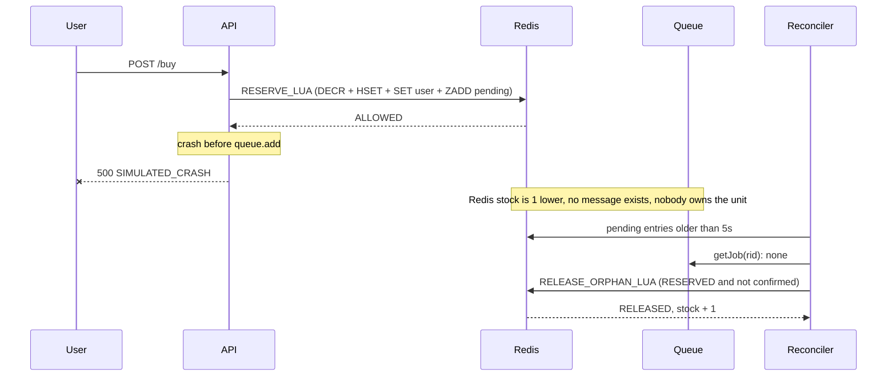
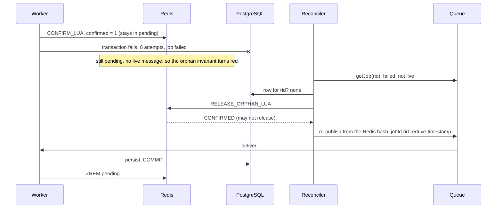
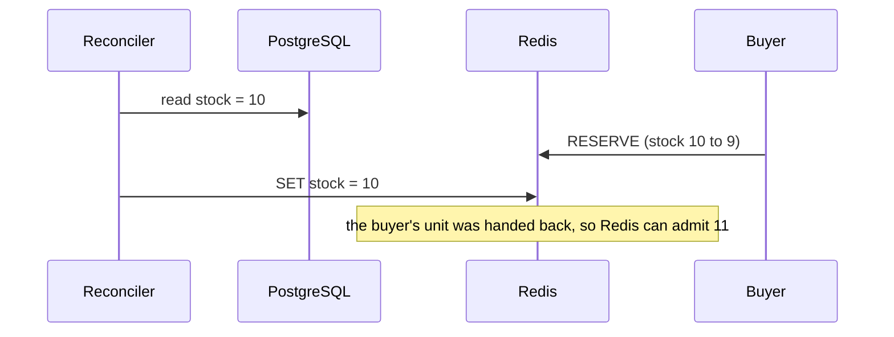
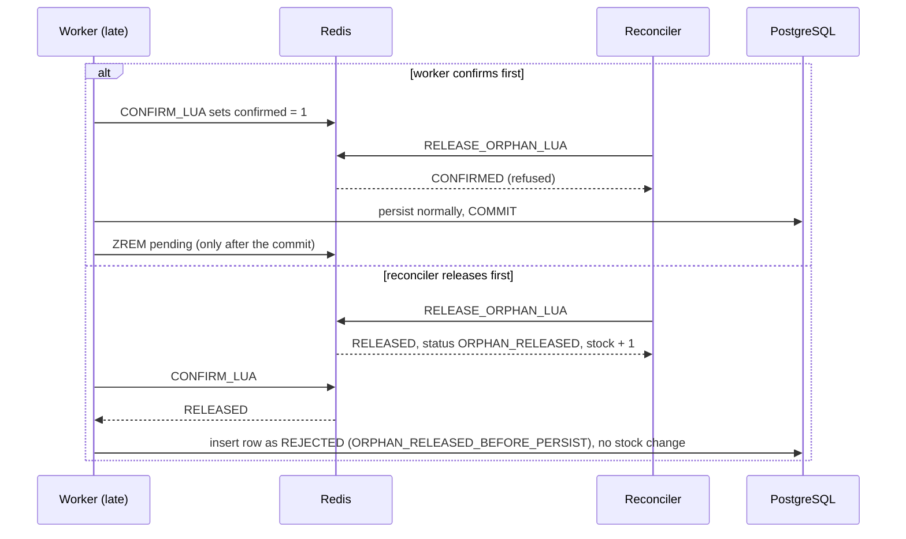

# 07 · Failure modes: what Redis atomicity does not fix

Previous: [Idempotency](06-idempotency.md) · Next: [Production considerations](08-production-considerations.md)

Redis makes *admission* atomic: at most 500 requests are ever told "reserved". But the demo spans three systems (Redis, the queue, PostgreSQL) and two processes (API, worker). Any of them can crash between two steps. This chapter goes through each failure: what happens, which invariant on the dashboard reveals it, what repairs it, and what production would do differently.

## Vocabulary

- **Dual write**: one operation that must update two systems that don't share a transaction (Redis, then the queue; PostgreSQL, then Redis). A crash between the two writes leaves them disagreeing.
- **Orphan**: a reservation Redis admitted but that nothing will ever persist or expire, because its queue message was never published.
- **Drift**: the difference between what Redis believes is available and what PostgreSQL (the source of truth) implies.
- **Reconciliation**: a background job that compares the systems and repairs differences after the fact.
- **Leak**: a unit that is neither available nor owned by anyone. Leaks cause **underselling**: customers are told "sold out" while units remain.
- **Fencing token**: a number or id that changes every time the "world" is restarted (here: every new sale). Work stamped with an old token is refused, so a straggler from before the restart can't damage the new state ([failure 10](#10-stale-messages-after-a-reset-the-fencing-token)).

## The invariants panel (Mode B)

| Invariant | What it checks | What red means |
|---|---|---|
| Redis stock ≥ 0 | current value, and the lowest value DECR ever returned | the counter went negative (expected briefly with the `decr` strategy) |
| RESERVED + PAID ≤ initial | PostgreSQL rows | real oversell of durable orders |
| PostgreSQL stock ≥ 0 | `Product.stock` | a decrement escaped the `stock > 0` guard |
| DB stock + RESERVED + PAID = initial | conservation | units appeared or vanished in PostgreSQL |
| Active orders = RESERVED + PAID | one order per live reservation | duplicate or missing orders |
| Every admitted reservation has a queue message | `pending ≤ waiting + active + delayed` | orphans: leaked units |
| Redis agrees with PostgreSQL (drift = 0) | `redisStock − (dbStock − pending − expiredNotYetReleased)` | Redis and PostgreSQL disagree |

The panel evaluates **facts** (PostgreSQL rows, the Redis stock value), not the counters in the metrics grid. Counters are observations and can themselves be wrong after a crash.

## 1. Redis crash or data loss

**What happens.** By default Redis keeps data in memory. Depending on persistence settings, a crash loses everything since the last RDB snapshot (minutes) or the last AOF fsync (about one second with `appendfsync everysec`). A **replica failover** is subtler: replication is asynchronous, so the primary can acknowledge a `DECR`, die, and leave a replica that never received it. The promoted replica now holds a stock that is too high, and writes the API was told had succeeded are gone.

The demo wipes everything under `flash:{flash-sneaker}:*` **and obliterates the BullMQ queue**, because BullMQ lives in the same Redis. It also rotates the **sale id** (the fencing token, [failure 10](#10-stale-messages-after-a-reset-the-fencing-token)) in PostgreSQL and Redis, because the queue is gone and this is effectively a new sale epoch. Then it re-seeds the stock one of three ways (`AdminService.simulateRedisDataLoss`):

- **From initial** (a naive restart script: `SET stock = initialStock`). Redis re-admits units that are already reserved in PostgreSQL. Test with 20 units and 10 already reserved: Redis admits 20 more, the worker creates 10 and **rejects 10** through PostgreSQL's guarded `UPDATE ... SET stock = stock - 1 WHERE stock > 0`. PostgreSQL never goes negative and nothing is oversold, but 10 users were told "reserved" and later rejected.
- **From the DB** (`SET stock = Product.stock`). Exactly 10 are admitted and all 10 are created. This is the correct rebuild.
- **No re-seed.** The stock key is missing, and buys return `503 NOT_INITIALIZED`. The reserve script refuses to guess: failing closed is better than admitting blindly.

In all three cases, reservations that were admitted and queued but not yet persisted are **lost with the queue**: those users were told "reserved" and have nothing.

**Which invariant shows it.** Right after "re-seed from initial", **drift** turns red with a positive value ("Redis will admit more than PostgreSQL can persist"). Afterwards the "rejected by DB guard" counter and `RESERVATION_REJECTED` events show the damage. The `REDIS_DATA_LOST` event reports how many queued jobs and pending reservations were lost. Later, when a reservation persisted *before* the loss expires, the Redis half of expiry finds no hash and emits `STOCK_RELEASE_SKIPPED`: Redis didn't get that unit back, so Redis and PostgreSQL may now disagree. Check drift, and rebuild Redis stock from the DB (reconcile with overwrite, failure 8) while idle.

**What repairs it.** Rebuild Redis from PostgreSQL, with the sale paused. The DB guard is what guarantees no durable oversell. That is why the worker re-checks stock in PostgreSQL even though Redis "already checked".

**Demo vs production.** The demo runs a single Redis node with default persistence. Production uses AOF, replicas and tested failover, and keeps the queue in a separate durable log so losing the admission cache doesn't also lose admitted orders. Even so, it plans for Redis to be rebuildable from the database.

## 2. API crash after the Redis reservation, before queue publication

This is the textbook **dual-write** problem. The API does two writes: reserve in Redis, then publish to the queue. If it dies in between, Redis has decremented and no message exists.



The demo's **API crash rate** slider makes a percentage of admitted requests throw after the Lua script and before `queue.add`. The client receives `500` with status `SIMULATED_CRASH`, and the event stream shows `ENQUEUE_FAILED`.

**Measured.** 20% crash rate, 2,000 requests on 500 units: 116 `SIMULATED_CRASH`, 384 `RESERVED`, 1,500 `SOLD_OUT`. Redis reached 0 and said "sold out" while PostgreSQL still had **116 unsold units**. This is **underselling**, not overselling.

**Why the Lua script records `pending`.** The reserve script adds the reservation id to the `pending` sorted set in the same atomic step as the `DECR`:

```lua
-- apps/api/src/flash/redis-scripts.ts (RESERVE_LUA)
local remaining = redis.call('DECR', KEYS[1])
redis.call('HSET', KEYS[2], 'status', 'RESERVED', ..., 'confirmed', '0')
redis.call('SET', KEYS[3], ARGV[1])
redis.call('ZADD', KEYS[4], ARGV[3], ARGV[1])
```

Because it is one script, there is no moment where stock has been taken but no record exists. A crash after the script leaves a **trace** the reconciler can find. With plain `DECR`, a crash right after the decrement leaves nothing but a smaller number. Nobody can tell which unit leaked, or whether one did. (The demo's `decr` strategy writes the record in a separate `MULTI` after the `DECR`. Its simulated crash happens after both, so it is still reconcilable, but a real crash between the two would leave no trace at all.)

**Which invariant shows it.** **"Every admitted reservation has a queue message"** turns red: more reservations are pending than messages that could persist them. (With **API publishes every message twice** ticked, each reservation has two messages, which can hide orphans from this simple count; the invariant's detail says so.) **Drift stays 0**, because the leaked units sit in `pending` and the formula subtracts pending (they look "in flight"). That is exactly why the dashboard needs a separate orphan check.

**What repairs it.** **Run reconcile.** It looks at `pending` entries older than the grace period (5 s), skips any with a live queue job or a PostgreSQL row, and calls `releaseOrphan`. In the run above it released all 116, and Redis went back to 116 = PostgreSQL.

But be honest about what reconciliation achieves. It fixes the **books**, not the **lost sales**. The buyers who were told "sold out" while 116 units sat leaked have gone. Prevention beats repair.

**Demo vs production.** Production removes the window instead of repairing it afterwards:

- **Atomic reserve + append**: the Lua script also does `XADD` to a Redis Stream, so the reservation and the message are one atomic step (the stream then has to be durable).
- **Transactional outbox**: write the intent into a database table in the same transaction as the state change, and let a relay publish it. See [Production considerations](08-production-considerations.md).
- Reconciliation still runs on a schedule, as a safety net with alerts.

## 3. Duplicate message delivery

**What happens.** Every practical queue is at-least-once (see [Idempotency](06-idempotency.md)). The same reservation message reaches the worker twice.

**Which invariant shows it.** With the transactional worker, none: the duplicate is a no-op (`DUPLICATE_MESSAGE_IGNORED`), and 10 concurrent deliveries give 1 `CREATED` + 9 `DUPLICATE`. With the **broken** worker, **conservation** fails (one row, two decrements), and PostgreSQL stock can go negative.

**What repairs it.** Nothing repairs it after the fact. The protection is prevention: the primary key `reservationId` plus side effects inside the same transaction.

**Demo vs production.** Same design. Production adds idempotency keys on *every* consumer and every external call (payments, emails, warehouse).

## 4. Worker crash mid-processing

**What happens.** The worker dies at some point inside `persist()`:

- **Before the PostgreSQL commit.** The transaction rolls back, so no row, no decrement and no order exist. BullMQ notices the job's lock has expired (a **stalled** job) and hands it to another worker. If the job threw an error instead, BullMQ retries it (`attempts: 8`, exponential backoff from 0.5 s to 64 s, about 2 minutes in total). The retry starts from scratch.
- **After the commit, before the ack.** Everything is persisted, but BullMQ doesn't know. It redelivers, and the retry is a `DUPLICATE` (failure 3).
- **Every attempt fails** (say PostgreSQL is down for longer than the ~2-minute retry budget). The job ends up `failed`, and no row exists. The worker already ran the Redis `confirm` handshake (`confirmed=1`), so the reconciler is not allowed to simply release the unit: a confirmed reservation might still reach PostgreSQL.

That last case is why the reservation **stays in `pending` until after the PostgreSQL commit**. `CONFIRM_LUA` only sets `confirmed=1`; the worker removes the id from `pending` (`clearPending`, a `ZREM`) only once the outcome is `CREATED` or `DUPLICATE`, i.e. the row is committed. For `REJECTED` or `STALE` it calls `MARK_REJECTED_LUA` instead ([05](05-reservations.md)). A confirmed-but-dead reservation is therefore still visible.



**Which invariant shows it.** Normally nothing stays red. If all retries are exhausted, the queue's `failed` count rises, and because the reservation is still in `pending` with no live message, **"Every admitted reservation has a queue message"** turns red.

**What repairs it.** The transaction plus redelivery plus idempotency for the first two cases. For the third, **Run reconcile**: for a pending entry older than the grace period with no live job and no PostgreSQL row, `RELEASE_ORPHAN_LUA` answers `CONFIRMED`, so the reconciler **re-drives** it instead: it rebuilds the message from the Redis hash (`reservationId, productId, userId, createdAtMs, expiresAtMs, saleId`), publishes it with job id `<rid>-redrive-<timestamp>`, and records a `REDRIVEN` event (counter "re-driven by reconciler"). This is safe even if the original attempt did commit after all, because the worker is idempotent: the re-driven message becomes a `DUPLICATE`. `failures.int-spec.ts` confirms a reservation, removes its job, and checks that reconcile re-drives it to `CREATED` with drift 0.

**Demo vs production.** The demo has no button to kill the worker mid-job or to take PostgreSQL down; these cases are covered by the transaction design, the duplicate tests and the re-drive test. `docker-compose.yml` restarts a crashed `api` or `worker` container (`restart: unless-stopped`), because a dead worker is silent: requests keep getting `202` while nothing is persisted. An earlier version of the demo removed the reservation from `pending` in the confirm step itself; a confirmed job that then failed all its retries leaked a unit the orphan check couldn't see. Keeping it pending until the commit closes that gap. Production would also alert on failed jobs and drift, and replay failed jobs from a dead-letter queue.

## 5. Slow or paused worker

**What happens.** The API keeps answering `202 RESERVED` in milliseconds, because it never waits for the database. Messages pile up in the queue (**queue lag**), and PostgreSQL falls behind Redis. Meanwhile:

- **Pay returns `409 NOT_PERSISTED`**: "Reservation accepted but not yet written to PostgreSQL by the worker. Retry in a moment." The user holds a reservation the database doesn't know about yet.
- **The TTL keeps running.** `expiresAt` is set by the API at admission time. If the worker persists the row after `expiresAt`, it is written as `RESERVED` with an expiry already in the past. Pay refuses it (`expiresAt > now` fails), and the sweeper expires it within a second.
- **The reconciler must not mistake slow for lost.** It skips pending reservations whose job is still waiting in the queue (`skippedInQueue` in its report).

**Which invariant shows it.** None turn red: drift stays 0 because unpersisted reservations are counted as `pending`. The signal is the queue depth in the pipeline view and the gap between "allowed" and "orders created".

**What repairs it.** Resuming the worker drains the queue.

**Demo vs production.** Production alerts on queue lag (the age of the oldest waiting message), autoscales workers within what the database can absorb, and either sets `expiresAt` when the row is persisted or extends the TTL by the lag, so users don't lose their hold because the backend was slow.

## 6. Crash between the database expiry and the Redis release

**What happens.** Expiry is another dual write: first PostgreSQL (`RESERVED → EXPIRED`, stock + 1, order cancelled, in one transaction), then Redis (`INCR` via `RELEASE_LUA`). If the process dies between the two, PostgreSQL has the unit back and Redis doesn't, so Redis won't sell it.

**Which invariant shows it.** None turns red, on purpose. The drift formula subtracts `expiredNotYetReleased` (rows with `status = EXPIRED AND redisReleasedAt IS NULL`), so the gap is recognised as "work in progress" rather than reported as a false alarm. The count is exposed as `flash.db.expiredNotReleasedToRedis` in `GET /api/state`; in production you'd alert if it stays above 0 for long.

**What repairs it.** The next sweep. It queries for `EXPIRED` rows with `redisReleasedAt IS NULL` and retries the release. The Lua script only releases a reservation Redis still sees as `RESERVED`, so a retry can't add the unit twice. `lifecycle.int-spec.ts` runs only the DB half, sees Redis at 1 and PostgreSQL at 2, and confirms that the next `sweep()` brings Redis to 2.

**Demo vs production.** Same pattern ("durable intent in the DB + idempotent remote step + retry until marked done"), with an alert if rows stay unreleased.

## 7. Pay racing expire

**What happens.** The user clicks Pay at the exact moment the sweeper expires the reservation.

**Which invariant shows it.** If you got this wrong, conservation would fail, or a paid order would have its unit returned to stock.

**What repairs it.** Nothing needs repairing, because the race is prevented. Both are conditional updates on the same row (`WHERE status = 'RESERVED'`). The row lock serializes them, and the loser's `WHERE` no longer matches. Measured: 15 races, exactly one winner each time, conservation held every time.

**Demo vs production.** With a real payment provider, the race moves to "the card was charged but the reservation expired". Production adds a `PAYMENT_PENDING` state that the sweeper doesn't expire, plus refunds for payments that arrive too late.

## 8. Redis/PostgreSQL drift

**How it arises.** Every failure above, plus manual edits, non-idempotent consumers, and bugs that update only one store.

**The formula** (`ReconcileService.drift()`):

```
drift = redisStock − (dbStock − pending − expiredNotYetReleased)
```

In plain words: Redis should equal "units PostgreSQL has available, minus the ones admitted but not yet persisted (they've left Redis but not yet PostgreSQL), minus the ones PostgreSQL got back but hasn't returned to Redis yet."

- **Negative drift**: Redis holds units nobody owns. That's a leak, and it means underselling.
- **Positive drift**: Redis will admit more than PostgreSQL can persist. Users are told "reserved" and are later rejected by the DB guard.

**What repairs it.** **Run reconcile** releases orphans and re-drives confirmed reservations whose job died. If drift remains while nothing is in flight, the drift invariant tells you to use **overwrite Redis stock from DB**. With that option ticked, it also does `SET stock = dbStock − expiredNotYetReleased`. That overwrite is a **blind write** and is dangerous:



The code refuses to overwrite while the queue or `pending` is non-empty, but that check is itself check-then-act: a buy can still land between the check and the `SET`. The demo is safe only because you press the button while nothing is happening. Production makes the overwrite safe by **pausing the sale** first, or by **fencing**: tagging writes with a version or epoch number, so a write based on an old reading is rejected (for example, a Lua compare-and-set that applies only if the version hasn't changed since it was read). The demo already uses this idea for queue messages ([failure 10](#10-stale-messages-after-a-reset-the-fencing-token)), but not for the overwrite.

## 9. Reconciler racing a slow worker

**What happens.** A reservation's message is late (the worker is slow, or the message was delayed). The reconciler sees an old pending reservation and wants to release it. The worker, meanwhile, is about to persist it. Without coordination, both would act: the unit would return to Redis *and* be sold in PostgreSQL, which is a positive drift and a potential double sale.

**The confirm handshake.** Before touching PostgreSQL, the worker runs `CONFIRM_LUA`. The reconciler's `RELEASE_ORPHAN_LUA` only releases a reservation that is `RESERVED` **and** `confirmed = 0`. Both are atomic scripts on the same hash, so Redis runs them in some order, and whichever runs first wins.



The reconciler also skips any reservation whose job is still live in the queue. In `failures.int-spec.ts`, a reservation waiting in a **paused** queue is skipped (`skippedInQueue: 1`). A message that is removed, reconciled, then delivered late produces `REJECTED_ORPHAN` and leaves PostgreSQL stock unchanged.

**Demo vs production.** The same handshake idea (a status flag both sides check atomically) is related to what production calls a **lease**: whoever holds it may act, everyone else must back off. The cleaner fix is to remove the window entirely with an outbox or atomic stream append, so there are no orphans to reconcile.

## 10. Stale messages after a reset: the fencing token

**What happens.** **Reset demo** pauses the queue, waits up to 10 seconds for active jobs to finish, obliterates the queue, wipes Redis and PostgreSQL, and seeds a fresh sale. Two kinds of straggler can still slip through:

- a **buy that was in flight** during the reset: it passed the Lua script against the old stock and publishes its message *after* the queue was wiped;
- a **job still running** when reset gave up waiting.

Without protection, such a message lands in the **new** sale: the reservation table is empty again, so the primary key doesn't recognise it as a duplicate, and the worker would insert it and decrement the new sale's stock. That unit was never admitted by the new sale's Redis counter, so PostgreSQL and Redis would disagree from the first second. The same applies after a simulated Redis data loss.

**The fix: a fencing token.** Every sale gets a random **sale id**, stored in `Product.saleId` in PostgreSQL and mirrored in `flash:{flash-sneaker}:sale` in Redis. Reset and the simulated Redis data loss generate a new one in both stores. The reserve script reads it and stores it in the reservation hash, the API copies it into the queue message, and the worker's guarded decrement requires it to match:

```sql
UPDATE product SET stock = stock - 1
WHERE id = $1 AND "saleId" = $2 AND stock > 0
```

(In the code: Prisma `updateMany` with `saleId: job.saleId`.) If it changes 0 rows and the product's `saleId` differs, the transaction **throws** so the reservation row it just inserted is rolled back as well, and the outcome is `STALE`: event `STALE_MESSAGE_DROPPED`, counter "stale (old sale) fenced out". The worker then marks the Redis hash rejected (if it still exists) without giving any stock back, since this sale never had that unit. The broken idempotency mode checks the `saleId` first too, so this failure doesn't muddy that experiment.

**Which invariant shows it.** None, because it's prevented. The counter and the `STALE_MESSAGE_DROPPED` events are the evidence. On the dashboard, the event list and the SSE stream start fresh whenever the sale id changes (the snapshot carries `saleId`), so you don't see the old sale's events mixed with the new one's.

**What repairs it.** Nothing needs repairing. `failures.int-spec.ts` reserves under one sale, resets, re-publishes the old message, and checks that it comes back `STALE` with no row, DB and Redis stock untouched and drift 0.

**Demo vs production.** This is the general **fencing token** pattern. Whenever a system can be "restarted" while old work is still in flight, give each generation a token that only moves forward, stamp work with it, and have the **resource itself** (here, the guarded `UPDATE`) reject old tokens. You'll meet it as Kafka's producer and leader **epochs**, ZooKeeper's `zxid`, and the fencing tokens Martin Kleppmann describes for distributed locks: a client whose lease expired can still wake up and write, so the storage must refuse writes carrying an old token. In production the sale id would come from the sale's own record (a new campaign, a new id) rather than a demo reset.

## Summary

| # | Failure | Visible as | Repaired by | Production fix |
|---|---|---|---|---|
| 1 | Redis data loss / failover | positive drift; `RESERVATION_REJECTED`; `REDIS_DATA_LOST` | re-seed from PostgreSQL (sale paused); DB guard prevents oversell | AOF + replicas; separate durable queue; rebuild procedure |
| 2 | API crash between Redis and queue | orphan invariant red (drift stays 0) | reconcile → `ORPHAN_RELEASED` | outbox or atomic reserve + `XADD` |
| 3 | Duplicate delivery | nothing (transactional); conservation red (broken) | prevention only | idempotent consumers everywhere |
| 4 | Worker crash mid-job / all retries fail | queue retries; `failed` count; orphan invariant red (still pending) | tx rollback + redelivery + idempotency; reconcile re-drives (`REDRIVEN`) | dead-letter queue + alerts |
| 5 | Slow / paused worker | queue depth; `NOT_PERSISTED` on pay | resume worker | lag alerts, autoscaling, TTL from persist time |
| 6 | Crash between DB expiry and Redis release | `flash.db.expiredNotReleasedToRedis` > 0 in `GET /api/state` (drift accounts for it) | next sweep (`redisReleasedAt IS NULL`) | same, with alerting |
| 7 | Pay vs expire race | (would be conservation) | prevented by conditional updates | plus `PAYMENT_PENDING` state |
| 8 | Drift | drift invariant | reconcile; overwrite only when idle | scheduled reconcile + alerts; fenced overwrite under sale pause |
| 9 | Reconciler vs slow worker | `REJECTED_ORPHAN` events | confirm handshake | leases, or no orphans via outbox |
| 10 | Stale message after reset / Redis data loss | `STALE_MESSAGE_DROPPED`; "stale (old sale) fenced out" | prevented by the `saleId` fencing token | epochs / fencing tokens on every generation change |

## Try it in the demo

**API crash (failure 2).** Click **Reset demo**. Set the **API crash rate** slider to 20%. Set Concurrent users to 2,000 and click **Run Redis test (B)**. Look at:
- the last-run result: roughly 20% of the ~500 admitted requests end as "crashed after reserve (500)", the rest as RESERVED, and 1,500 as SOLD_OUT;
- Redis stock at 0 while **DB stock** still shows the leaked units;
- the invariant **Every admitted reservation has a queue message** in red, while **drift = 0** stays green;
- `ENQUEUE_FAILED` events in the stream.

Wait at least 5 seconds (the grace period), then click **🧹 Run reconcile**. The toast reports the number of released orphans, `ORPHAN_RELEASED` events appear, and Redis stock now equals DB stock. Set the slider back to 0%.

**Redis data loss (failure 1).** Set **Reservation TTL** to 300 (so nothing expires mid-experiment), click **Reset demo**, run a Redis test with 300 users, and wait for the queue to drain. Click **Wipe + re-seed from initial**. Drift turns red at +300: Redis says 500 are available, PostgreSQL says 200. Run another Redis test with 500 users: all 500 are admitted, then `RESERVATION_REJECTED` events appear and "rejected by DB guard" rises, while `RESERVED + PAID ≤ initial` stays green. Repeat with **Wipe + re-seed from DB** (drift stays 0, no rejections) and **Wipe, no re-seed** (buys in Try it yourself get `503 NOT_INITIALIZED`).

**Slow worker and reconciler (failures 5 and 9).** Click **Reset demo**, then **⏸ Pause worker**. Set **Reservation TTL** to 10. In **Try it yourself**, click **🛒 Buy**, then **💳 Pay**: `409 NOT_PERSISTED`. Wait 5 seconds (the orphan grace period) and click **🧹 Run reconcile**: the toast says "skipped 1 still queued", because the job is merely waiting, not lost. Wait more than 10 seconds and click **▶ Resume worker**. The row is persisted already past its expiry, and within a second the sweeper emits `RESERVATION_EXPIRED` and `STOCK_RELEASED`. Pay now returns `EXPIRED`.

**Expiry (failures 6 and 7).** Run a Redis test, wait for the drain, then click **💳 Pay 50% of active** and **⏱ Run expiry sweep now** after the TTL has passed. Every invariant stays green. Paid reservations never return stock, and expired ones return it exactly once.

**Tests.** `npm run test:integration` runs `failures.int-spec.ts` (crash + reconcile, paused queue, late worker, confirmed-but-dead job re-driven by reconcile, stale message after a reset fenced out, three Redis re-seed strategies) and `lifecycle.int-spec.ts` (crash between expiry halves, concurrent expiry, pay vs expire).
