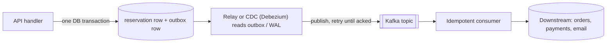

# 08 · Production considerations: what this demo deliberately doesn't do

Previous: [Failure modes](07-failure-modes.md) · Next: [Interview answer](09-interview-answer.md)

The demo runs on one laptop, with one Redis, one PostgreSQL and two Node processes. It is built to make the *ideas* observable, not to survive a real launch. This chapter lists, honestly, what a production flash sale adds on top, and why.

## 1. Capacity math first

Before choosing components, do the arithmetic. The interview scenario: 500 units, 2 million users clicking "Buy" at 12:00.

| Quantity | Estimate | Consequence |
|---|---|---|
| Requests | 2,000,000 arriving over about 10 s | ≈ **200,000 req/s** at peak, more in the first second |
| Successful buyers | 500 | **99.975%** of requests must be told "no", and cheaply |
| Redis, one node, one hot key | tens of thousands to ~100k+ simple ops/s on one core; a small Lua script is somewhat slower than a bare `DECR` | **one key on one node can't absorb 200k req/s alone**; you need load shedding in front of it |
| PostgreSQL writes | at most **500** reservation inserts (plus expiries and payments) | the database is never the bottleneck **if nothing else reaches it** |
| PostgreSQL per-click design | 200k transactions/s on **one hot row** | impossible: the row lock serializes them, and each holds it for ~1 ms or more |
| Concurrent connections | up to 2M open sockets | a load balancer and edge problem, not a Redis problem |

The key insight: the expensive, durable work is tiny (500 writes). The problem is **rejecting 1,999,500 requests cheaply and fairly** without letting them reach anything stateful. Most production measures below are about that.

For comparison, the demo on a laptop: the Redis path handled 10,000 requests with exactly 500 `RESERVED` and a p95 latency of about 33 ms at 100 connections. The naive PostgreSQL path oversold, for example 551 orders for 500 units from 1,000 requests, or 636 orders and stock −136 from 2,000 requests at 500 connections. See [the naive solution](02-naive-solution.md).

## 2. The checklist

### Redis availability and durability

**Demo:** single node, default persistence. BullMQ shares that Redis.

**Production:**
- **AOF persistence** (`appendfsync everysec`, accepting about 1 s of loss, or `always` at a large throughput cost), plus **replicas** and automatic failover (Sentinel, Redis Cluster, or a managed service).
- Know the residual risk: replication is **asynchronous**. A failover can lose writes the primary already acknowledged, so a promoted replica may hold a stock count that is too high. `WAIT` narrows the window but doesn't close it.
- Therefore treat Redis as a **rebuildable cache of the decision**. Have a tested runbook: pause the sale, rebuild the stock from PostgreSQL (`dbStock − unpersisted`), resume. The demo's "re-seed from DB" button is the toy version.
- Never re-seed from the *initial* stock after the sale has started. See [Failure modes §1](07-failure-modes.md).
- Treat a rebuild as a **new epoch**: bump a fencing token so any work still in flight from before the rebuild is refused (next section).

### Fencing tokens: refuse work from a previous generation

**Demo:** every sale has a random `saleId`, stored in `Product.saleId` and mirrored in Redis. Reset and the simulated Redis data loss generate a new one. Queue messages carry the `saleId` they were admitted under, and the worker's guarded `UPDATE ... WHERE id = ? AND saleId = ? AND stock > 0` drops a message from an older sale as `STALE` ([Failure modes §10](07-failure-modes.md#10-stale-messages-after-a-reset-the-fencing-token)).

**Production:** the same pattern appears wherever something can be restarted, failed over or re-elected while old work is still in flight: Kafka's producer and leader epochs, ZooKeeper's `zxid`, lease-based locks with fencing tokens, a versioned Redis rebuild. The rule is always the same: the token only moves forward, every piece of work carries it, and the **resource that is written to** (not the sender) rejects old tokens. Checking "is my lease still valid?" in the client isn't enough, because a client can pause (GC, network) right after checking.

### A durable queue, separate from the admission cache

**Demo:** BullMQ on the same Redis. Losing Redis loses the stock **and** the admitted-but-unpersisted orders.

**Production:** a durable, replicated log such as **Kafka**, or **Redis Streams** on a separately persisted Redis. A *log* keeps messages after they are read, replays from an offset, and replicates across brokers. The lessons don't change: at-least-once delivery, idempotent consumers, monitoring consumer lag. See [the queue chapter](04-queue.md).

### Closing the dual-write window

**Demo:** reserve in Redis, *then* publish to the queue. A crash in between leaks a unit, and a reconciler with a grace period and a confirm handshake repairs it later. The reservation stays in the `pending` set until PostgreSQL has committed it, so the reconciler also finds reservations the worker confirmed but whose job then died, and re-publishes their message (safe because the worker is idempotent).

**Production options, best first:**

1. **Atomic reserve + append.** Make the Lua script do `XADD` to a Redis Stream in the same script as the `DECR`. The reservation and the message become one atomic step. There is no window. (The stream needs AOF and replicas, because it is now the durable hand-off.)
2. **Transactional outbox.** When the source of truth is a database, write the business change *and* an "outbox" row in the **same database transaction**. A separate **relay** reads unsent outbox rows and publishes them to the broker, retrying until acknowledged. Delivery is at-least-once, so consumers stay idempotent.
3. **Change Data Capture (CDC).** Instead of a polling relay, a tool such as **Debezium** tails the database's write-ahead log and publishes each committed outbox row (or each change) to Kafka.



Note the catch for this design: in a flash sale the first write goes to **Redis**, not to a database, precisely to avoid the database on the hot path. That's why option 1 (keep the "outbox" inside Redis, in the same script) fits better than a database outbox here.

4. **Reconciliation** still runs on a schedule as a safety net, with alerts. It is never the primary mechanism, because it fixes the books but not the customers who were told "sold out" during the leak.

### The hot-key problem

**Demo:** one counter key, `flash:{flash-sneaker}:stock`. The `{...}` hash tag pins every key of the product to one Redis Cluster slot, which multi-key Lua scripts require.

**Production:** one key lives on one shard, and adding replicas doesn't add *write* capacity. At ~100k ops/s per key, you need either fewer requests reaching the key or more keys:

- **Stock bucketing (sharding).** Split 500 units into, say, 10 buckets of 50, each with its own hash tag so they spread across shards. Route each user to a bucket (hash of the user id, or random). When a bucket is empty, try one or two others before saying "sold out". Trade-offs: you may briefly say "sold out" while another bucket still has units, so you need rebalancing, or a final pass through all buckets. The per-user limit also has to become cross-bucket.
- **Local "sold out" flag.** Once Redis says `SOLD_OUT`, each API instance remembers it in process memory and rejects further requests without calling Redis at all. With 2M requests and 500 units, almost every request after the first few seconds is answered from memory. The flag needs a short TTL or a pub/sub "stock returned" signal, because expired reservations put units back.
- **Admission tokens upstream.** A waiting room (below) admits only a few thousand users per second into the buy path, so the key never sees 200k ops/s.

### Edge protection: most requests should never reach your servers

- **CDN** for the product page, static assets and the "sold out" page.
- **Waiting room / virtual queue.** Users who arrive before or at 12:00 get a queue position. Batches are let through at a rate the backend can handle, each with a signed, short-lived token that the buy endpoint requires. This turns a 2M-request spike into a controlled flow, and it is also the natural place to implement fairness.
- **Rate limiting** per IP, per account and per device, at the load balancer or API gateway.
- **Bot protection**: device fingerprinting, proof-of-work or CAPTCHA challenges, account age and history checks. Flash sales are bot magnets, because scalpers profit from them.
- **Per-user limits** enforced in more than one place (see below).
- **Fairness.** "First come, first served" rewards the fastest connection and the best bot. Alternatives: a **lottery** (register during a window, then draw winners), or a randomised queue position for everyone who arrived before 12:00.

### Connection limits

2M *concurrent connections* is a load-balancer and operating-system problem: file descriptors, ephemeral ports, memory per socket, and the CPU cost of TLS handshakes. Spread them across many edge nodes (DNS, anycast, CDN), keep the buy request tiny and short-lived, and let the waiting room hold the long-lived connections (or let clients poll a CDN-cached status). The demo's "in-flight connections" setting goes up to 1,000 from one process. That is enough to show races, and nowhere near this.

### Per-user limit, enforced twice

**Demo:** a Redis key `user:<uid>` set by the reserve script. The `decr` strategy has no per-user limit.

**Production:** keep the Redis check (it's fast), and add a **partial unique index** in PostgreSQL as the durable guard:

```sql
CREATE UNIQUE INDEX one_active_reservation_per_user
  ON "Reservation" ("productId", "userId")
  WHERE status IN ('RESERVED', 'PAID');
```

Prisma can't express partial indexes in its schema, which is why the demo leaves this out. A raw SQL migration would add it. Identity checks (verified accounts, payment instruments) stop one person from posing as 50 users.

### Payments

**Demo:** "Pay" is a database state change.

**Production:**
- Pass an **idempotency key** to the payment provider (the `reservationId` works) so that a retried charge isn't a second charge.
- Add a **`PAYMENT_PENDING`** state that the expiry sweeper doesn't touch while a payment is being authorised. Otherwise the sweeper can expire a reservation whose card has just been charged.
- Handle **late payments**: a payment confirmed after expiry triggers an automatic refund, or is honoured if the unit is still available.
- Put **timeouts** on every call to the provider, and reconcile with its records (webhooks are at-least-once too).
- Client-facing `Idempotency-Key` headers on `/buy` and `/pay` that **replay the original response**. See [Idempotency §10](06-idempotency.md).

### Monitoring and alerts

The demo's invariants panel is the prototype. In production, export these as metrics and alert on them:

| Signal | Why it matters | Alert when |
|---|---|---|
| Drift (`redisStock − (dbStock − pending − expiredNotYetReleased)`) | Redis and PostgreSQL disagree | ≠ 0 for longer than the in-flight window |
| Orphans (pending older than grace, no job) | dual-write leaks → underselling | > 0 |
| Queue lag (age of oldest message, depth) | users hold unpersisted reservations; TTLs may elapse | lag > a few seconds |
| `RESERVATION_REJECTED` rate | Redis admitted units PostgreSQL didn't have | > 0 (it should be zero in a healthy sale) |
| Failed / dead-lettered jobs | lost work (the demo retries 8 times over ~2 min, then the reconciler re-drives) | > 0 |
| Re-drives and stale drops (`REDRIVEN`, `STALE_MESSAGE_DROPPED`) | jobs dying after confirm; work arriving from a previous epoch | > 0 outside a planned rebuild |
| Expiry rate vs payment rate | payment flow broken, or bots holding stock | expiries spike |
| `EXPIRED` rows with `redisReleasedAt IS NULL` | half-finished expiries | stays > 0 |
| p99 latency, error rate, Redis CPU and ops/s, DB pool saturation | capacity | approaching limits |

Also: structured logs with the reservation id on every event (the demo prints JSON lines), and tracing across API → queue → worker.

### Load testing

The demo's CLI (`npm run load:redis -- --users 20000 --concurrency 500`) shows the shape of the problem on one machine. Production needs distributed load generators (k6, Gatling, Locust, or a cloud service), tests at **2–3× the expected peak**, tests of the waiting room and CDN as well as the API, and **game days**: kill a Redis primary, pause the consumers, and check that the alerts fire and the runbooks work.

### Graceful degradation

Decide in advance what each component's failure means:

- **Redis down:** fail **closed**. Return "temporarily unavailable" (the demo's `503 NOT_INITIALIZED`). Never fall back to "check stock in PostgreSQL per click"; that just moves the outage to the database.
- **Queue down:** stop admitting, or compensate immediately (release the Redis reservation) if the publish fails, so nothing leaks.
- **Database slow or down:** admissions can continue up to the stock while the queue buffers, but reservation TTLs keep ticking. Pause the TTL clock or extend it, and don't let users pay until their reservation is persisted.
- **Everything overloaded:** the waiting room slows the release rate. A static "sold out" page is served from the CDN as soon as the local flags flip.

### Multi-region

A single counter can't be both global and fast. Options: run the sale's inventory in **one primary region** (everyone pays the latency to that region, which is simple and fair), or **pre-allocate stock per region** (fast, but one region can sell out while another still has units, so you need a rebalancing step). Either way, PostgreSQL's source-of-truth row lives in one place, and cross-region failover is an operational decision, not something automatic.

## 3. Safe enough for this demo vs. production

| Area | This demo | Why it's fine here | Production |
|---|---|---|---|
| Redis durability | default persistence, single node | data loss is a button you press on purpose | AOF + replicas + tested failover; Redis treated as rebuildable; runbook to re-seed from the DB with the sale paused |
| Queue | BullMQ on the same Redis | shows at-least-once, retries and lag with zero extra infrastructure | durable replicated log (Kafka, or Redis Streams with AOF) separate from the admission cache; or an outbox table + relay / CDC |
| API → queue dual write | reconciler with 5 s grace + Lua confirm handshake; `pending` cleared only after the DB commit; confirmed-but-dead jobs re-driven | makes the leak visible, then repairable | atomic reserve + `XADD` in one script, or a transactional outbox; reconciler as a scheduled safety net with alerts |
| Worker idempotency | PK = `reservationId`, `ON CONFLICT DO NOTHING`, side effects in the same tx | already production-grade | same, plus idempotency keys on every external side effect (payments, email, warehouse) |
| Client retries | per-user Redis key (`ALREADY_RESERVED` returns the held `reservationId`); conditional updates | effects are idempotent, and a retried buy still learns its id | `Idempotency-Key` header with stored responses |
| Stale work after a reset / rebuild | `saleId` fencing token checked in the guarded `UPDATE` | already the right pattern | same, with the token tied to the sale or rebuild epoch |
| Expiry | DB-driven sweeper, conditional update, idempotent Redis release, `redisReleasedAt` | already the right pattern | same, plus `PAYMENT_PENDING`, alerts on unreleased rows |
| Per-user limit | Redis key only (Lua strategy) | demonstrates the atomic check | plus a DB partial unique index; identity and bot checks |
| Hot key | one counter key | one laptop can't saturate it anyway | stock buckets across shards, local sold-out flag, waiting room |
| Load shedding | none; every request reaches Redis | the point is to watch Redis handle it | CDN, waiting room, rate limits, local sold-out flag |
| Reconciler overwrite | manual button, refuses if busy, still racy | you press it while idle | only with the sale paused, with fencing or versioning, plus alerts |
| Observability | invariants panel, event stream, JSON logs | built for teaching | metrics + alerts on drift, orphans, lag, rejects; tracing |
| Load generation | one Node process, ≤ 1,000 in flight | shows races and the single-node ceiling | distributed load tests at 2–3× peak, game days |
| Multi-region, auth, payments, fraud | none | out of scope | obviously required |

## 4. What doesn't change

Everything above adds layers *around* the core. The core stays the same as in the demo:

1. Atomic admission in Redis, so at most `stock` requests are told "reserved".
2. A queue between the spike and the database.
3. PostgreSQL as the source of truth, re-checking with a guarded `UPDATE ... WHERE stock > 0` (and a fencing token, so old work can't write into a new sale).
4. Reservations with DB-driven expiry, via conditional transitions.
5. Idempotent consumers keyed by an id created before persistence.
6. Reconciliation and invariants, because the systems will drift.

If you can explain why each of these exists, you can explain the production version. [The interview answer](09-interview-answer.md) puts it all together.
