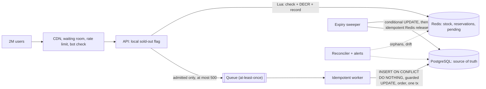

# 09 · The interview answer

Previous: [Production considerations](08-production-considerations.md) · Start: [The problem](01-problem.md)

> **"Design a flash sale. There are 500 units. At 12:00, 2 million users click Buy. How do you prevent overselling?"**

This chapter is a ready-to-use answer at two lengths plus a deeper walkthrough, a diagram to draw, then the follow-up questions interviewers actually ask and the mistakes that cost points. Each claim is tied back to an experiment you can run in this repository, so you can say "I built this and measured it" rather than "I read it somewhere".

---

## The 30-second answer

> "The database can't take 2 million writes on one row, and a read-then-update check oversells under concurrency. So I'd put an **atomic admission counter in Redis**: a Lua script checks stock and the per-user limit, decrements, and records the reservation in one step, so at most 500 requests are ever admitted. Admitted requests go onto a **queue**, and a worker writes them to **PostgreSQL**, which stays the **source of truth** and re-checks stock with a guarded `UPDATE ... WHERE stock > 0`. The user gets a **reservation with a TTL**, not a purchase. Expiry is driven by the database, and the worker is **idempotent** because queues deliver at least once. Finally, a **reconciler** and invariants catch the drift that dual writes between Redis and the queue inevitably cause."

## The 2-minute answer

> "Let me start with why the obvious version fails. A checkout that does `SELECT stock`, checks it's positive, then `UPDATE`s, has a race: hundreds of requests read 'stock = 1' before any of them writes. In my demo, 1,000 requests against 500 units created 551 orders. The correct database versions, a conditional `UPDATE ... WHERE stock > 0` or `SELECT ... FOR UPDATE`, don't oversell, but every buyer serializes on one hot row and every click costs a connection and a transaction. 2 million clicks would take the database down, along with the rest of the site.
>
> So I separate **admission** from **bookkeeping**.
>
> **Admission** happens in Redis. Redis runs commands one at a time on a single thread, so an atomic decrement can't interleave. I use a small Lua script that checks the stock and whether this user already holds a reservation, then decrements, writes a reservation record, and adds it to a 'pending' set, all atomically. 1,999,500 requests get 'sold out' in about a millisecond and never touch the database.
>
> **Bookkeeping**: each admitted request gets a reservation id, generated by the API, and is published to a queue. Workers consume at a rate PostgreSQL can handle. They insert the reservation with the id as the primary key, `ON CONFLICT DO NOTHING`, and only if the insert happened do they decrement stock with a guarded update and create the order, all in one transaction. That makes duplicate deliveries harmless. The database re-checks stock because Redis isn't durable: if Redis loses data, the database guard is what actually prevents oversell.
>
> The user is told 'reserved for 10 minutes, please pay'. A sweeper expires unpaid reservations with a conditional update, so pay and expire racing can't both win, and only the winner returns the unit to the database and then to Redis.
>
> What Redis doesn't fix is the **dual write**: if the API crashes after the Redis decrement but before publishing, that unit leaks. I'd close that window by having the Lua script append to a Redis Stream in the same atomic step, or with an outbox, and keep a reconciler with alerts on drift as a safety net. And in front of all of this: CDN, a waiting room, rate limiting and bot protection, so most of the 2 million requests never reach my servers."

---

## Deeper discussion: the pieces and why each exists

### 1. Atomic admission in Redis

- **Why Redis:** in memory, sub-millisecond, ~100k+ simple operations per second per core, and no connection-pool starvation. Its job is to say **no** cheaply to the 99.975% who can't succeed.
- **Why it's atomic:** commands execute one at a time. `DECR` reads, modifies and writes inside one command, so two clients can't both see `1` and both take it.
- **Why Lua rather than plain `DECR`:** `DECR` alone is correct for the counter. But the decision also depends on a *read* (does this user already hold a reservation?), and it has to update *several keys* together: the counter, the reservation record, the user key, and the pending set. A sequence of commands sent from the application can interleave with other clients. A Lua script cannot. A side benefit: the stock never goes negative, whereas `DECR`-then-`INCR`-if-negative shows negative values and costs two writes for every sold-out request.

### 2. A queue to protect the database

The queue decouples the arrival rate (spiky, 200k/s) from the rate the database can absorb (steady, a few thousand per second). Only admitted requests are enqueued, so the database sees at most ~500 writes for the whole sale. The API answers `202 Accepted` without waiting for the database.

### 3. PostgreSQL is the source of truth, with a guarded update

Redis is a **cache of the decision**. PostgreSQL is the **record of the decision**. The worker never trusts Redis blindly:

```sql
UPDATE product SET stock = stock - 1 WHERE id = $1 AND stock > 0;  -- 0 rows → REJECTED
```

This is the last line of defence. When the demo's Redis is wiped and naively re-seeded, Redis over-admits, and this guard is the only thing that stops a real oversell.

The demo's real guard has one more condition, `AND sale_id = $2`: a **fencing token** identifying the current sale. A message admitted before a reset or a Redis rebuild carries the old id, changes 0 rows, and is dropped as stale instead of writing into the new sale.

### 4. Reservations with TTL and DB-driven expiry

A buyer gets a time-boxed **hold**, not a purchase. Expiry is driven by the database (`status = 'RESERVED' AND expires_at < now()`), not by a Redis key TTL. A Redis key that expires disappears silently: nothing gives the unit back. Each expiry is a conditional transition. Only the caller whose `UPDATE ... WHERE status = 'RESERVED'` changed one row returns stock, first in the database (in the same transaction), then in Redis through an idempotent Lua release. A `redis_released_at` flag lets the sweeper finish the Redis half after a crash.

### 5. Idempotent consumers

Every real queue is at-least-once. The reservation id is created by the API *before* anything is persisted and travels in the message. It is the primary key, so a duplicate insert does nothing, and the side effects (stock decrement, order creation) only run on the path where the insert succeeded, in the same transaction. "Exactly-once" in practice means **at-least-once + idempotent consumer**.

### 6. Reconciliation and invariants

Two systems without a shared transaction **will** drift. Track invariants such as:
- conservation: `dbStock + reserved + paid = initial`
- drift: `redisStock − (dbStock − pending − expiredNotYetReleased) = 0`
- orphans: every pending reservation has a queue message

A reconciler releases orphans (admitted, never queued, never confirmed). A handshake flag in Redis stops it from racing a slow worker. A reservation leaves the pending set only after PostgreSQL has committed it, so if the worker confirmed it but its job then died, the reconciler still sees it and **re-publishes** the message instead (safe, because the worker is idempotent).

### 7. Closing the dual-write window: the outbox idea

Reconciliation repairs leaks after the fact, but the customers who saw "sold out" in the meantime are gone. It's better to remove the window:
- **Atomic reserve + append**: the Lua script also `XADD`s the reservation to a durable Redis Stream. One atomic step, no window.
- **Transactional outbox**: when the first write goes to a database, write the change and an outbox row in one transaction, and let a relay or CDC (Debezium) publish it.

### 8. Hot-key mitigation

One key lives on one shard (~100k ops/s), and replicas don't add write capacity. Mitigations: a **local in-process "sold out" flag** (after the first `SOLD_OUT`, an API instance stops asking Redis), **stock buckets** spread across shards (10 keys × 50 units), and a **waiting room** that limits how many users reach the buy endpoint.

### 9. Edge protection

CDN for static content and the sold-out page; a waiting room or virtual queue issuing signed admission tokens; rate limits per IP, account and device; bot protection; per-user limits enforced in Redis **and** with a database partial unique index; and, if fairness matters more than speed, a lottery.

---

## The whiteboard diagram

Draw this while you talk:



Or in ASCII, if you only have a marker:

```
  2M users
     |   CDN / waiting room / rate limits / bot checks
     v
  +-----+   (1) Lua, atomic: if stock > 0 and user has none   +-------------------+
  | API | -----> DECR, record reservation, ZADD pending -----> |       Redis       |
  +-----+                                                     | (admission cache) |
     |                                                        +-------------------+
     | (2) publish {reservationId}, at most 500 messages                ^
     v                                                                  |
  +-------+  (3) at-least-once  +-------------------+                   |
  | Queue | ------------------> | Idempotent worker |                   |
  +-------+                     +-------------------+                   |
                                          |                             |
            (4) one transaction:          |                             |
            INSERT ... ON CONFLICT        |                             |
            DO NOTHING; if inserted:      |                             |
            UPDATE stock WHERE stock > 0; |                             |
            create order                  v                             |
                                +------------------------------+        |
                                | PostgreSQL (source of truth) |        |
                                +------------------------------+        |
                                          ^                             |
                                          |                             |
                      Sweeper: (5) expire due RESERVED rows in the DB,  |
                               then (6) idempotent release in Redis ----+

  Reconciler + alerts: orphans, drift, queue lag, rejects
```

---

## Follow-up questions and model answers

**1. "What if Redis crashes?"**
The counter, the reservation records and, if the queue lives in Redis, the queue all lose recent writes. Asynchronous replication can lose acknowledged writes on failover. Rule: never re-seed from the initial stock. Pause the sale, rebuild from PostgreSQL, resume. The database's guarded update prevents durable oversell even when Redis over-admits. Users who got "reserved" may then be rejected, which is bad UX, not oversell. Mitigations: AOF + replicas, and keep the queue in a separate durable log. *(Demo: re-seeding from initial with 10 of 20 units already held → 20 admitted, 10 created, 10 rejected, database never negative.)*

**2. "What if the API crashes after the DECR, before publishing?"**
Classic dual write. The unit leaks: Redis says it's taken, nobody owns it. That causes **underselling**, not overselling. Because my Lua script records the reservation in a pending set atomically with the decrement, a reconciler can find pending entries with no queue job after a grace period and release them. A handshake flag stops it from racing a slow worker. The better fix is no window at all: `XADD` to a stream inside the same Lua script, or an outbox. *(Demo: 20% crash rate → 116 leaked units, Redis "sold out" while PostgreSQL had 116 left. Reconcile released all 116, but those sales were lost.)*

**3. "How do you prevent duplicate orders?"**
An idempotency key created **before** persistence: the reservation id from the API, carried in the message, used as the primary key. `INSERT ... ON CONFLICT DO NOTHING`, and side effects only if the insert happened, in the same transaction. `UNIQUE(order.reservation_id)` as a backstop. For HTTP retries, an `Idempotency-Key` header that replays the stored response. (The demo does a light version: a retried buy gets `409 ALREADY_RESERVED` *with* the reservation id the user already holds, so a client whose first response was lost can still pay.) *(Demo: 10 concurrent deliveries → 1 created, 9 duplicates.)*

**4. "Why not just use the database with `SELECT ... FOR UPDATE`?"**
It's *correct*: no oversell. But every request takes a connection and a transaction, and all of them queue on **one row lock**. Throughput is about 1 / lock-hold-time, so a few thousand per second at best, while 200k/s arrive. The pool starves, latency explodes, timeouts cascade, and the same database is serving the rest of the site. Correct isn't the same as scalable. I *do* use the database's conditional update, but only for the ~500 admitted requests.

**5. "Why Lua instead of `DECR`?"**
`DECR` is atomic for the counter, and `DECR`, then `INCR` back if negative, is a correct admission check. But the per-user check and recording the reservation are extra commands that can't be combined atomically with it, the counter goes visibly negative, and every sold-out request costs two writes. Crucially, a crash right after a bare `DECR` leaves no trace to reconcile. Lua does the check, the decrement and the bookkeeping in one atomic step. Keep scripts tiny, because Redis serves nobody else while a script runs.

**6. "How do reservations expire?"**
From the database, not Redis TTLs. A sweeper finds `RESERVED` rows past `expires_at` and runs `UPDATE ... SET status = 'EXPIRED' WHERE id = ? AND status = 'RESERVED'`. Only the caller that changed a row returns stock (in the same transaction), then releases in Redis via an idempotent script, then sets `redis_released_at`. A crash between the steps is retried by the next sweep. Pay is the same kind of conditional update, so pay vs expire has exactly one winner. *(Demo: 8 concurrent expiries → 1 success; 15 pay/expire races → 1 winner each time.)*

**7. "Kafka vs Redis Streams vs BullMQ?"**
All three are at-least-once, so the consumer must be idempotent whichever you pick.
- **Kafka**: durable, replicated, partitioned log, with replay and high throughput. Best for production and fan-out to many consumers. Costs more to operate.
- **Redis Streams**: a log inside Redis, with consumer groups and pending-entry lists. You can `XADD` *inside the reservation Lua script*, which kills the dual write. Durability is Redis's (AOF + replicas).
- **BullMQ**: a job queue on Redis, with retries, delays, pause, and a nice developer experience. Fine for a demo or moderate scale, but it shares Redis's fate: lose Redis and you lose the stock *and* the queue.

**8. "How do you handle 2M concurrent connections?"**
That isn't Redis's problem. It belongs to the load balancer and the edge. Spread connections across many edge nodes (DNS/anycast/CDN), serve everything cacheable from the CDN, put a waiting room in front that holds users and releases them at a controlled rate with signed tokens, and keep the buy request tiny and short-lived. A local "sold out" flag in each API instance makes the long tail of requests nearly free.

**9. "How do you handle fairness and bots?"**
First come, first served rewards the best bot. Use bot protection (fingerprinting, challenges, account age), rate limits per IP/account/device, per-user limits enforced in Redis **and** with a database partial unique index on `(product, user) WHERE status IN ('RESERVED','PAID')`, verified identities, and, if fairness matters, a waiting room with randomised positions or a registration lottery.

**10. "How do you know the system is correct in production?"**
Invariants turned into metrics and alerts: conservation (`stock + reserved + paid = initial`), no oversell (`reserved + paid ≤ initial`), drift = 0, no orphans, `REJECTED` count = 0 (if it's non-zero, Redis admitted something the database couldn't honour), queue lag, failed jobs. A scheduled reconciler, structured logs with the reservation id, tracing, and load tests and game days before the sale. *(Demo: every one of these is a live panel that turns red when you break something.)*

**11. "What consistency model does the user see?"**
Admission is **linearizable**: one Redis key, one thread, so there's a single global order of decisions. But the durable record is **eventually consistent**: the reservation reaches PostgreSQL after queue lag, so Pay can briefly return "not persisted yet, retry". In rare failures (Redis data loss) a "reserved" can be **revoked** by the database guard. So the API returns `202 Accepted` and tells the user "**reserved**, complete payment", never "purchased". The purchase is final only when the payment commits in PostgreSQL.

**12. "How do you scale beyond one Redis node?"**
First reduce load on the key: a waiting room upstream, and local sold-out flags. Then shard the stock: N bucket keys, each with its own hash tag so they land on different shards, users routed by hash, falling back to other buckets when one is empty, with a rebalancing pass at the end. Keep each bucket's keys under one hash tag so the multi-key Lua script still works. For many products, products naturally spread across shards.

**13. "What if the worker is slow or the database is down?"**
Admission continues (at most `stock` messages can ever be queued), messages wait, and users hold reservations the database doesn't know about yet. Alert on queue lag. Watch the TTL: if the reservation is persisted after `expires_at`, it expires immediately. Set or extend the expiry at persist time when there's lag. Never let a slow database push you back to checking stock in the database per click.

**14. "Why not WATCH/MULTI or a distributed lock?"**
`WATCH`/`MULTI` is optimistic concurrency. On one hot key almost every transaction aborts and retries, so throughput collapses. A distributed lock (for example Redlock) around "read stock, write stock" serializes everything with extra round trips, and lock expiry under GC pauses needs fencing tokens to be safe. An atomic operation on the counter needs no lock at all.

**15. "What if the user never pays, or the payment fails?"**
The reservation expires and the unit goes back on sale, exactly once. For real payments, add a `PAYMENT_PENDING` state the sweeper doesn't expire, pass the reservation id as the payment provider's idempotency key, and refund payments that confirm after expiry.

**16. "Isn't the reconciler's 'overwrite Redis from the database' dangerous?"**
Yes. It's a blind `SET` racing live decrements: read 10 from the database, a buyer takes one in Redis, then `SET 10` hands that unit out again. Only do it with the sale paused, or with fencing (a version number checked atomically by the write). Prefer targeted repairs (release specific orphans) over overwrites.

**17. "What if a message from before a restart arrives after it?"**
Say the sale is reset, or Redis is rebuilt, while a buy is in flight or a worker is still running. The old message reaches the worker after the new sale has started. The primary key doesn't help: the new sale has no row with that id, so it isn't a "duplicate". The fix is a **fencing token**: every sale (or rebuild) gets a new id, every message carries the id it was admitted under, and the database write checks it (`UPDATE ... WHERE id = ? AND sale_id = ? AND stock > 0`). An old token changes 0 rows, the transaction rolls back, and the message is dropped. It's the same idea as Kafka's epochs, ZooKeeper's `zxid` and fenced leases: the resource being written to rejects work from an older generation, because the sender can't reliably know it's stale. *(Demo: a message admitted before a reset and re-published after it comes back `STALE`, with no row written and drift 0.)*

**18. "Someone was told 'sold out', then a reservation expired. Who gets that unit?"**
Not "whoever retries fastest": that rewards bots and hammering. Keep a waitlist (a Redis sorted set by join time), and when a unit is freed, hand it to the first person in line *in the same atomic script that frees it*. Then it never sits in the public stock where it could be sniped. The handed-off unit becomes a normal reservation with its own TTL: notify the shopper (push, email, SMS), and if they don't pay, it moves to the next in line. If the process dies between the hand-off and publishing its message, it's just an orphan, and the reconciler passes it on. *(Demo: `test/waitlist.int-spec.ts`; Lab → Try it yourself → 🔔 Join waitlist.)*

---

## Mistakes to avoid

| Mistake | Why it's wrong | Say instead |
|---|---|---|
| "Redis `DECR` guarantees no oversell." | It guarantees no over-*admission* while Redis keeps its data. Data loss or a bad re-seed over-admits. | "Redis admits; PostgreSQL's guarded update is the guarantee." |
| Relying on Redis key TTL to return stock | A key that expires vanishes silently. Nothing increments the stock, and keyspace notifications are fire-and-forget. | "TTLs are garbage collection. Expiry is a DB-driven conditional transition." |
| Ignoring the dual write | "Reserve in Redis, then publish to Kafka" leaks units on a crash in between. | "Atomic reserve + `XADD`, or an outbox; reconciler as a safety net." |
| Assuming exactly-once delivery | Every queue redelivers. Without idempotency you get double orders or double decrements. | "At-least-once + idempotent consumer keyed by an id created upstream." |
| A unique key with the side effect outside the guard | The row dedupes, the decrement doesn't (the demo's "broken" mode). | "Claim the key first, side effects after, one transaction." |
| Hitting the database on every click | Pool starvation and a hot-row lock. The database dies for the whole site. | "Only ~500 admitted requests ever reach the database." |
| Read-then-write anywhere | Check-then-act races (the naive mode oversold by 51–136 units in the demo). | "Conditional updates; check row counts." |
| No reconciliation or monitoring | Drift is inevitable and silent. | "Invariants as metrics, alerts on drift, orphans, lag and rejects." |
| Telling users "purchased" at admission | It's a reservation; it can expire or, rarely, be revoked. | "202 Accepted: reserved, complete payment." |
| Re-seeding Redis from the initial stock after a crash | Re-admits units already sold. | "Rebuild from PostgreSQL with the sale paused." |
| "Redis handles 2M requests, done." | One hot key ≈ one shard ≈ ~100k ops/s, and 2M connections is an edge problem. | "Waiting room, local sold-out flag, bucketing, CDN." |
| Falling back to the database when Redis is down | Moves the outage to the source of truth. | "Fail closed: 503, retry later." |

---

## What I learned from building the demo

> **Claims, and the experiments that back them** (measured on a laptop; see the linked chapters)
>
> - **Naive read-then-update oversells, and it's not rare.** 1,000 requests on 500 units → **551 orders**. 2,000 requests at 500 connections → **636 orders, stock −136**. The `lost-update` variant hides it: stock looks fine while orders exceed it. → [02](02-naive-solution.md)
> - **Atomic admission works and is fast.** 10,000 requests → **exactly 500 RESERVED**, p95 ≈ **33 ms** at 100 connections. The integration test proves ≤ 500 for 2,000 concurrent attempts with both the Lua and the `DECR` strategy. → [03](03-redis-atomicity.md)
> - **Redis atomicity does not fix the dual write.** At a 20% crash rate, 2,000 requests on 500 units gave **116 crashes, 384 reserved, 1,500 sold out**. Redis said "sold out" while PostgreSQL still had **116 units**: underselling. Drift stayed 0 (the leaked units looked "in flight"), so I needed a **separate orphan check**. Reconcile restored all 116, but those buyers were already gone. **Prevention beats repair.** → [07](07-failure-modes.md)
> - **The database guard is the real guarantee.** After Redis data loss with a naive re-seed (20 units, 10 already held), Redis admitted 20, the worker created 10 and **rejected 10**, and PostgreSQL never went negative. Ten people were told "reserved" and then refused. Re-seeding from the database admitted exactly 10. → [07](07-failure-modes.md)
> - **Idempotency must cover the side effect, not just the row.** 10 concurrent deliveries → **1 CREATED + 9 DUPLICATE**. The "broken" worker kept one row but decremented stock twice, and conservation failed. Deleting a single `if (inserted.count === 0) return 'DUPLICATE'` line made **3 tests fail**. → [06](06-idempotency.md)
> - **Conditional updates make races boring.** 8 concurrent expiries → **1 succeeded**, stock +1 once in both stores. Pay vs expire, 15 runs → **one winner every time**. A crash between the database expiry and the Redis release was repaired by the next sweep. → [05](05-reservations.md), [06](06-idempotency.md)
> - **Two systems need a handshake.** The reconciler skipped a reservation waiting in a paused queue. A worker that arrived after the reconciler released its unit recorded `REJECTED` and changed no stock, thanks to the Lua confirm flag. → [07](07-failure-modes.md)
> - **BullMQ on the same Redis is a shared fate.** Wiping Redis lost the queue too: admitted-but-unpersisted reservations vanished. → [04](04-queue.md)
> - **A code review still found two gaps, and both were "work that slips between two systems".** (1) The worker removed a reservation from `pending` when it *confirmed*, before writing to PostgreSQL. A job that confirmed and then failed every retry leaked a unit that neither the orphan check nor the reconciler could see. Fix: keep it pending until the commit, and let the reconciler **re-drive** confirmed reservations whose job died. (2) A message admitted before a reset could still be persisted into the *new* sale. Fix: a **`saleId` fencing token** checked by the guarded `UPDATE`. Both now have integration tests. → [07](07-failure-modes.md)

Reproduce all of it: `npm test` (unit and Lua script tests) and `npm run test:integration` (invariants, idempotency, lifecycle, failures), or use the buttons in the dashboard's Failure lab.
